## main执行前和执行后的代码可能是什么？

**main****函数执行之前**，主要就是初始化系统相关资源：

- 设置栈指针
- 初始化静态变量和全局变量，`data`段的内容
- 将未初始化的全局变量赋初值，即`bss`段的内容
- 全局对象初始化后在`main`之前调用构造函数
- 将`main`函数的`argc,argv`传给`main`函数然后才真正运行`main`函数
- `__attribute__((constructor))`

**main****函数执行之后**： 

- 全局对象的析构函数会在main函数之后执行
- 可以用`atexit`注册一个函数，会在main之后执行
- `__attribute__((destructor))`

`atexit`函数

`int atexit(void(void*func)void)`

[atexit](http://blog.chinaunix.net/uid-20937170-id-3447901.html)

## C/C++内存分区

C


C++

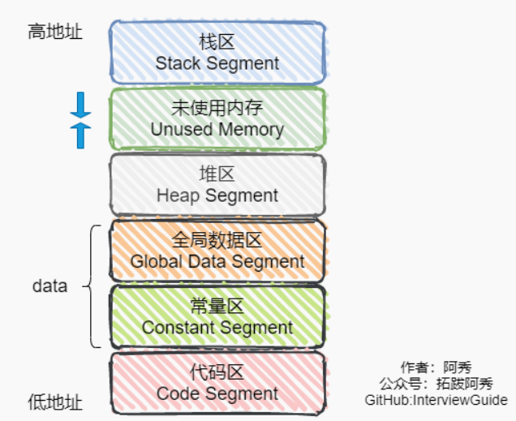

- **代码区**  存放函数体的二进制代码

- **常量存储区**   这里面存放的是常量，不允许修改

- **全局/静态存储区**  全局变量和静态变量被分配到同一块内存中，在以前的C语言中，全局变量和静态变量又分为初始化的和未初始化的，在C++里面没有这个区分了，它们共同占用同一块内存区，在该区定义的变量若没有初始化，则会被自动初始化，例如int型变量自动初始为0

- **自由存储区**   如果说堆是操作系统维护的一块内存，那么自由存储区就是C++中通过new和delete动态分

  配和释放对象的抽象概念。需要注意的是，自由存储区和堆比较像，但不等价

- **堆区**  就是那些由 new分配的内存块，他们的释放编译器不去管，由我们的应用程序去控制，一般一个new就要对应一个 delete。如果程序员没有释放掉，那么在程序结束后，操作系统会自动回收

- **栈**  在执行函数时，函数内局部变量的存储单元都可以在栈上创建，函数执行结束时这些存储单元自动被释放。栈内存分配运算内置于处理器的指令集中，效率很高，但是分配的内存容量有限

## 结构体对齐

- 结构体内成员按照声明顺序存储，第一个成员地址和整个结构体地址相同
- 原则1：每一个元素放置到内存中时，它都会认为内存是以它自己的大小来划分的
- 原则2：按长度最大的对齐

```c++
struct s1{
    char a;			//char放在0处  
    int b;			//int发现第一个四字节已经有数据所以放在第二个4字节,放在4处
    double c;		//double发现第一个八字节已经有数据所以放在第二个8字节
}
```


```c++
struct s2{
    char a;
    double b;
    int c;
}
```


c++11以后引入两个关键字 `alignas`与 `alignof`

`alignas`:指定结构体对齐方式.当`alignas`小于自然对齐的最小单位，则被忽略。

`alignof`:计算类型的对齐方式

```c++
// alignas 生效的情况
struct Info {
 uint8_t a;
 uint16_t b;
 uint8_t c;
};
std::cout << sizeof(Info) << std::endl; // 6 2 + 2 + 2
std::cout << alignof(Info) << std::endl; // 2

struct alignas(4) Info2 {
 uint8_t a;
 uint16_t b;
 uint8_t c;
};
std::cout << sizeof(Info2) << std::endl; // 8 4 + 4
std::cout << alignof(Info2) << std::endl; // 4
```

## 3、指针和引用的区别

- 指针是一个变量，存储的是一个地址，引用跟原来的变量实质上是同一个东西，是原变量的别名

- 指针可以有多级，引用只有一级

- 指针可以为空，引用不能为NULL且在定义时必须初始化

- 指针在初始化后可以改变指向，而引用在初始化之后不可再改变

- `sizeof`指针得到的是本指针的大小，`sizeof`引用得到的是引用所指向变量的大小

- 引用在声明是必须初始化，而指针可以不初始化
- 当把指针作为参数进行传递时，也是将实参的一个拷贝传递给形参，**拷贝的是指针的值而不是指针指的对象**，两者指向的地址相同，但不是同一个变量，在函数中改变这个变量的指向不影响实参，而引用却可以。

## 4、在传递函数参数时，什么时候该使用指针，什么时候该使用引用呢？

- 需要返回函数内局部变量的内存的时候用指针。而返回局部变量的引用是没有意义的

- 对栈空间大小比较敏感（比如递归）的时候使用引用。使用引用传递不需要创建临时变量，开销要更小
- 类对象作为参数传递的时候使用引用，这是C++类对象传递的标准方式

## 5、堆和栈的区别

|              | 堆                                                           | 栈                                                           |
| ------------ | ------------------------------------------------------------ | ------------------------------------------------------------ |
| 管理方式     | 程序员手动申请手动释放                                       | 系统自动分配                                                 |
| 空间大小     | 堆是不连续的内存区域（系统用链表来存储空闲的内存区域自然是不连续的），大小受限于计算机系统中有效的虚拟内存（32位系统理论上是`4G`），堆的空间比较大`1G-4G`。 | 栈是一块连续的内存区域，大小是操作系统预定好的，默认`4M`     |
| 碎片         | 堆会产生碎片                                                 | 对于栈，它是有点类似于数据结构的栈，进出一一对应不会产生碎片。 |
| 生长方向     | 向高地址方向生长                                             | 向低地址方向生长                                             |
| 分配方式     | 堆都是动态分配的（没有静态分配的堆）                         | 栈有静态分配和动态分配，静态分配由编译器完成动态分配由`alloca`函数分配，但栈的动态分配的资源由编译器进行释放，无需程序员实现。 |
| 分配效率     | 堆由C/C++库函数提供，机制复杂，效率比栈要慢。                | 栈由计算机底层对其进行支持，有专门的寄存器存放栈地址，       |
| 内存管理机制 |                                                              |                                                              |

## 6、堆快还是栈快

栈快，操作系统会在底层对栈提供支持，会分配专门的寄存器存放栈的地址，栈的入栈出栈操作也十分简单，并且有专门的指令执行，所以栈的效率比较高也比较快。

而堆的操作是由C/C++函数库提供的，在分配堆内存的时候需要一定的算法寻找合适大小的内存。并且获取堆的内容需要两次访问：**第一次访问指针**，**第二次根据指针保存的地址访问内存**，因此堆比较慢。

## 7、区别以下指针类型

```c++
int* p[10];		//p表示一个数组，里头存放10个int*的变量
int(*p)[10];	//p表示数组指针，指向存有10个int的数组
int* p(int);	//p表示一个函数，函数返回int*
int(*p)(int);	//p表示函数指针，指向一个函数，这个函数有一个int形参，返回类型是int
int (*p(int)) (int*,int);//p本身有形参列表所以p是一个函数，然后前面有*，所以p返回一个指针
						 //进一步观察发现指针的类型本身也有形参列表，所以指针指向函数，该函数返回						   //int
```

## 8、`new/delete`与`malloc/free`

**相同点**

- 都用于动态分配内存

**不同点**

- 前者是C++运算符，后者是C/C++语言标准库函数
- new自动计算要分配的空间大小，`malloc`需要手工计算
- new调用名为**operator new**的标准库函数分配足够空间并调用相关对象的构造函数，delete对指针所指对象运行适当的析构函数；然后通过调用名为**operator delete**的标准库函数释放该对象所用内存。后者均没有相关调用，需要库文件支持，前者不用

## 9、new和delete如何实现

**new**

```c++
Complex* pc=new Complex(1,2);
/*实现*/
void* mem=operator new(sizeof(Complex));//通过operator new()分配具体大小的内存，内部调malloc(n)
										//生成一个void*指针
pc=static_cast<Complex*>(mem);			//将void*指针转型为本来类型的指针
pc->Complex::Complex(1,2);				//调用构造函数
```

**delete**

```c++
delete pc;
/*实现*/
Complex::~Complex(pc);					//先调用析构函数
operator delete(pc);					//然后调用operator delete()内部调用free
```

## 10、malloc和new的区别

- malloc和free是标准库函数，支持覆盖；new和delete是运算符，不重载。
- malloc仅仅分配内存空间，free仅仅回收空间，不具备调用构造函数和析构函数功能，new和delete除了分配回收功能外，还会调用构造函数和析构函数。
- malloc和free返回的是void类型指针（必须进行类型转换），new和delete返回的是具体类型指针。

## 11、既然有了malloc/delete，C++为什么还需要new/delete

在对非基本数据类型的对象使用的时候，对象创建的时候还需要执行构造函数，销毁的时候要执行析构函数。而malloc/free是库函数，是已经编译的代码，所以不能把构造函数和析构函数的功能强加给malloc/free，所以new/delete是必不可少的。

## 12、被free回收的内存是立即返还给操作系统吗

不是的，被free回收的内存会首先被**`ptmalloc`**使用**双链表**保存起来，当用户下一次申请内存的时候，会尝试从这些内存中寻找合适的返回。这样就避免了频繁的系统调用，占用过多的系统资源。同时**`ptmalloc`**也会尝试对小块内存进行合并，避免过多的内存碎片。

## 13、宏定义和函数有何区别

- 宏在编译时完成替换，之后被替换的文本参与编译，相当于直接插入了代码，运行时不存在函数调用，执行起来更快；函数调用在运行时需要跳转到具体调用函数
- 宏定义相当于在结构中插入代码，没有返回值；函数调用具有返回值
- 宏定义参数没有类型，不进行类型检查；函数具有类型，进行类型检查
- 宏定义不要在最后加分号，换行时用加`/`

## 内联函数和宏定义的区别？

- 宏只在预处理阶段进行简单的文本替换，而内联函数可以进行参数类型检查（编译时），且具有返回值。
- 内联函数在编译时直接将函数代码嵌入到目标代码中，省去函数调用的开销来提高执行效率，并且进行参数类型检查，具有返回值，可以实现重载。
- 宏定义时要注意书写（参数要括起来）否则容易出现歧义，内联函数不会产生歧义
- 内联函数有类型检测、语法判断等功能，而宏没有

## 14、宏定义和typedef区别？

- 宏主要用于定义常量及书写复杂的内容，只是文字替换；typedef主要用于定义类型别名，是定义了一个类型。

- 预处理阶段处理宏定义，编译阶段处理typedef。

- 宏不检查类型，typedef检查数据类型

- 宏不是语句，不在在最后加分号；typedef是语句，要加分号标识结束。

- 注意对指针的操作，`typedef char* p_char`和`#define p_char char*`区别巨大。

  ```c
  typedef char* t_char;
  #define d_char char*
  p_char a,b;//a,b都是char*
  d_char c,d;//c是char*，d是char
  ```

## 15、宏定义和`const`的区别

编译阶段

- `define`是在编译的**预处理**阶段起作用，而`const`是在**编译**的时候起作用

安全性

- `define`只做替换，不做类型检查和计算，也不求解，容易产生错误
- `const`常量有数据类型，编译器可以对其进行类型安全检查

内存占用

- define只是将宏名称进行替换，在内存中会产生多分相同的备份。const在程序运行中只有一份备份
- 宏定义的数据没有分配内存空间，只是插入替换掉；const定义的变量只是值不能改变，但要分配内存空间。

## C++中const和static作用

### **`static`**

**不考虑类的情况**

- 非静态全局变量的作用域是整个源程序， 当一个源程序由多个源文件组成时，非静态的全局变量在各个源文件中都是有效的。 而静态全局变量则限制了其作用域， 即只在定义该变量的源文件内有效， 在同一源程序的其它源文件中不能使用它。【利用这一特性可以在不同的文件中定义同名函数和同名变量，而不必担心命名冲突。】
- 全局变量改变为静态变量改变了他的作用域，局部变量改变为静态变量改变了他的生命周期
- 默认初始化为0

**考虑类的情况**

static成员变量:

- 有时候类需要一些成员与类本身直接相关，而不是与类的各个对象保持关联。比如说一个银行账户类可能需要一个数据成员表示当前的基准利率，利率与类关联而非与类的每个对象关联。从实现效率的角度来看，没有必要对每个对象都存储利率信息。
- 定义时要分配空间，不能在类声明中初始化，必须在类定义体外部初始化，初始化时不需要标示为static；可以被非static成员函数任意访问。

static成员函数：

- 不具有this指针，无法访问类对象的非static成员变量和非static成员函数；不能被声明为const、虚函数和volatile；可以被非static成员函数任意访问

### `const`

不考虑类的情况

- const常量在定义时必须初始化，之后无法更改

考虑类的情况

- const成员变量：不能在类定义外部初始化，只能通过构造函数初始化列表进行初始化，并且必须有构造函数；不同类对其const数据成员的值可以不同，所以不能在类中声明时初始化

- const成员函数：const对象不可以调用非const成员函数；非const对象都可以调用；不可以改变非

  mutable（用该关键字声明的变量可以在const成员函数中被修改）数据的值

## C++顶层const和底层const区别

- 顶层const：指的是const修饰的变量**本身**是一个常量，无法修改，指的是指针，就是 * 号的右边
- **底层**const：指的是const修饰的变量**所指向的对象**是一个常量，指的是所指变量，就是 * 号的左边

```c++
const int a, int const a;//
const int *a=&b;//其中a为指向int型变量的指针，const在 * 左侧，表示a指向不可变常量
int *const a=&b;//依旧是指针类型，表示a为指向整型数据的常指针
```


## 17、`.c`文件到可执行文件的过程


- **预处理**：根据以#开头的命令修改原始的C程序，比如将`#include<stdio.h>`的内容直接插入到程序文本中，以`.i`结尾。
- **编译阶段**：将`hello.i`翻译成`hello.s`，翻译成汇编指令
- **汇编阶段**：将`hello.s`翻译成机器语言指令，把这些指令打包成为一种叫做**可重定位目标程序**的格式，将结果保存在`hello.o`文件中，这是一个二进制文件。
- **链接阶段**：程序需要多个`.o`文件，链接就是将这些文件并到一起。链接器（`ld`）负责处理这种并入，最终得到可执行目标文件

## 18、override和final关键字

**override**

当在父类中使用了虚函数时候，你可能需要在某个子类中对这个虚函数进行重写。

**finale**

当不希望某个类被继承，或不希望某个虚函数被重写，可以在类名和虚函数后添加final关键字

## C++有哪几种构造函数？

- 默认构造函数
- 初始化构造函数（有参构造）
- 拷贝构造函数
- 委托构造
- 转换构造函数

## 拷贝初始化和直接初始化？

- 直接初始化：直接调用与实参匹配的构造函数

- 拷贝初始化：首先调用指定的构造函数创建一个临时对象，然后用拷贝构造函数将临时对象拷贝到正在创建的对象。

```c++
string str1("I am a string");//直接初始化
string str2(str1);           //直接初始化，str1时已经存在的对象，直接调用构造函数进行初始化
string str3="I am a string"; //拷贝初始化，先为字符串”I am a string“创建临时对象，再把临											时对象作为参数，使用拷贝构造函数构造str3
string str4=str3;            //拷贝初始化，这里相当于【隐式调用拷贝构造函数】，而不是调用赋值运算符函数
```

为了提高效率，允许编译器跳过创建临时对象这一步直接调用构造函数构造要创建对象，就完全等价于直接初始化了。但一下两种情况例外：

- 当拷贝构造函数为private时：语句3和语句4在编译时会报错
- 使用explicit修饰构造函数时：如果构造函数存在隐式转换，编译时会报错

## 初始化和赋值的区别？

- 简单类型没什么区别
- 复杂类型区别就大了

```c++
string str1("I am a string");
string str2=str1;			 //初始化 调用的是拷贝构造函数
string str3;
str5=str1;                   //赋值   调用的是拷贝赋值
```

## 浅拷贝和深拷贝的区别

如果一个类成员中有指针变量

**浅拷贝**：浅拷贝只是拷贝一个指针，并没有新开辟一个地址，拷贝的指针和原来的指针指向同一块地址，如果原来的指针所指向的资源释放了，那么再释放浅拷贝的指针的资源就会出现错误。

**深拷贝**；深拷贝不仅拷贝值，还开辟出一块新的空间用来存放新的值，即使原先的对象被析构掉，释放内存了也不会影响到深拷贝得到的值。在自己实现拷贝赋值的时候，如果有指针变量的话是需要自己实现深拷贝的。

## extern"C"的用法

在cpp文件中调用extern“C”，告诉编译器代码是C写的，按照C进行编译。C语言不支持。

- C++调用C函数：

```c++
//xx.h
extern int add(...)
//xx.c
int add(){
 
}
//xx.cpp
extern "C" {
 #include "xx.h"
}
```

- C调用C++函数

```c++
//xx.h
extern "C"{
 int add();
}
//xx.cpp
int add(){ 
}
//xx.c
extern int add();
```

## C++的重载、重写、隐藏区别

- **重载**

是指在同一范围定义中的同名成员函数才存在重载关系。主要特点是**函数名相同，参数类型和数目有所不同**，**不能仅仅依靠返回值不同来区分重载函数**。

- **重写（override）**

重写指的是在派生类中覆盖基类中的同名函数，**重写就是重写函数体要求基类函数必须是虚函数**，并且：

与基类的虚函数有相同的参数个数

与基类的虚函数有相同的参数类型

与基类的虚函数有相同的返回值类型

## public 、protected、 private访问和继承权限public 、protected 、private 区别

**访问权限**

- public的变量和函数在类的内部外部都可以访问。
- protected的变量和函数只能在类的内部和其派生类中
- private修饰的元素只能在类内访问。

**继承权限**

- **public继承**

基类的公有成员和保护成员作为派生类的成员时，**都保持原有的状态**，而**基类的私有成员仍然是私有的，不能被这个派生类的子类所访问**。

- **protected继承**

基类的所有公有成员和保护成员都成为派生类的**保护成员**，并且只能被它的派生类成员函数或友元函数访问，基类的私有成员仍然是私有的。


- **private继承**

基类的所有公有成员和保护成员都成为派生类的**私有成员**，**并不被它的派生类的子类所访问**，基类的成员只能由自己派生类访问，无法再往下继承

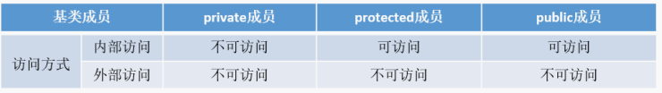

## 如何用代码判断大小端存储

- 大端存储：字数据的高位存储在低地址中
- 小端存储：字数据的低位存储在低地址中

**Socket编程中**，**往往需要将操作系统所用的小端存储的IP地址转换为大端存储**。

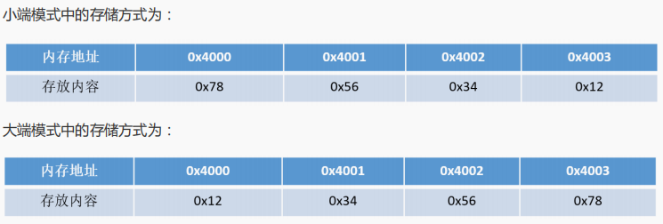

- **方法一：强制类型转换**

```c++
#include <iostream>
using namespace std;
int main()
{
 	int a = 0x1234;
 	//由于int和char的长度不同，借助int型转换成char型，只会留下低地址的部分
 	char c = (char)(a);//强转之后 c为ASCII码对应的字符
 	if (c == 0x12)
 		cout << "big endian" << endl;
 	else if(c == 0x34)
 		cout << "little endian" << endl; 
}
```


## C++11有哪些新特性

- `nullptr`替代`NULL`
- 引入了 `auto` 和 `decltype `这两个关键字实现了类型推导
- 基于范围的 `for `循环`for(auto& i : res){}`
- 类和结构体的中初始化列表
- Lambda 表达式（匿名函数）
- `std::forward_list`（单向链表）
- 右值引用和move语义

## ``auto、decltype、decltype(auto)``用法

- auto

  C++11新标准引入了auto类型说明符，用它就能让编译器替我们去分析表达式所属的类型。auto让编译器通过初始值来进行推演，从而火的定义变量的类型。必须初始化

- decltype

  我们希望从表达式中推断出要定义变量的类型，但却不想用表达式的值去初始化变量。还有可能是函数的返回类型为某表达式的值类型。它的作用是选择并返回操作数的数据类型，在此过程中，**编译器只是分析表达式并得到它的类型，却不进行实际的计算表达式的值。**

  ```c++
  int func() {return 0};
  //普通类型
  decltype(func()) sum = 5; // sum的类型是函数func()的返回值的类型int, 但是这时不会实际调用
  函数func()
  ```

## C++中NULL和nullptr区别

NULL来自C语言，一般由宏定义实现，而 nullptr 则是C++11的新增关键字。

C语言中NULL被定义为(void *)0，C++中NULL为整数0。编译器一般对其实际定义如下：

```c++
#ifdef __cplusplus  //如果这是一段C++代码
#define NULL 0
#else
#define NULL ((void *)0)
#endif
```

在C++中指针必须有明确的类型定义。但是将NULL定义为0带来的另一个问题是无法与整数的0区分。因为C++中允许有函数重载，所以可以试想如下函数定义情况：

```c++
#include <iostream>
using namespace std;
void fun(char* p) 
{
 	cout << "char*" << endl; 
}
	void fun(int p) 
{
 	cout << "int" << endl; 
}
int main()
{
 	fun(NULL);
	return 0; 
}//输出结果：int
```

在传入NULL参数时，会把NULL当做整数0来看，如果我们想调用参数是指针的函数，该怎么办呢?。nullptr在C++11被引入用于解决这一问题，nullptr可以**明确区分整型和指针类型**，能够根据环境**自动转换成相应的指针类型**，**但不会被转换为任何整型**，所以不会造成参数传递错误。

**nullptr的实现**

```c++
const class nullptr_t{
public:
 	template<class T> inline operator T*() const{ return 0; }
 	template<class C, class T> inline operator T C::*() const { return 0; }
private:
 	void operator&() const;
} nullptr = {};
```

但是仍然有问题

```c++
#include <iostream>
using namespace std;
void fun(char* p) 
{
	cout<< "char* p" <<endl; 
}
void fun(int* p) 
{
 	cout<< "int* p" <<endl; 
}
void fun(int p) 
{  
 	cout<< "int p" <<endl; 
}
int main()
{
	fun((char*)nullptr);//语句1   这里必须显示指明参数类型
	fun(nullptr);		//语句2
	fun(NULL);			//语句3
	return 0; 
}
//运行结果：
//语句1：char* p
//语句2:报错，有多个匹配
//3：int p
```

## ！！！C++的多态性如何实现

在基类的函数前加上**virtual**关键字，在派生类中重写该函数，运行时将会根据所指对象的实际类型来调用相应的函数，如果对象类型是派生类，就调用派生类的函数，如果对象类型是基类，就调用基类的函数。

```c++
#include<iostream>
using namespace std;

class Base
{
public:
    virtual void func()
    {
        cout<<"Base::func()"<<endl;
    }
};

class Son1:public Base
{
public:
    virtual void func() override
    {
        cout<<"Son1::func()"<<endl;
    }
};

class Son2:public Base
{

};

int main()
{
    Base* base=new Son1;
    base->func();
    base=new Son2;
    base->func();
    delete base;
    base=nullptr;
    return 0;
}
//结果
//Son1::func()
//Base::func()
```

**底层原理？**

虚表：虚函数表的缩写，类中含有virtual关键字修饰的方法时，编译器会自动生成虚表

虚表指针：在含有虚函数的类实例化对象时，对象地址的前四个字节存储的指向虚表的指针

**实现过程：**

- 编译器在发现基类中有虚函数时，会自动为每个含有虚函数的类生成一份虚表，该表是一个一维数组，虚表里保存了虚函数的入口地址
- 编译器会在每个对象的前四个字节中保存一个虚表指针，即**vptr**，**指向对象所属类的虚表**（派生类没有重写就指向基类，重写指向自己的）。在构造时，根据对象的类型去初始化虚指针vptr，从而让vptr指向正确的虚表，从而在调用虚函数时，能找到正确的函数
- 在派生类定义对象时，程序运行会自动调用构造函数，在构造函数中创建虚表并对虚表初始化。在**构造子类对象时，会先调用父类的构造函数，此时，编译器只“看到了”父类，并为父类对象初始化虚表指针，令它指向父类的虚表**；当**调用子类的构造函数时，为子类对象初始化虚表指针，令它指向子类的虚表**。
- 当派生类对基类的**虚函数没有重写**时，派生类的虚表指针指向的是**基类的虚表**；当派生类对基类的虚函数重写时，*派生类的虚表指针指向的是***自身的虚表**；当派生类中有自己的虚函数时，在自己的虚表中将此虚函数地址添加在后面，重写父类的虚函数，该虚函数的地址在没有重写的虚函数后面。

## 为什么析构函数一定写成虚函数？

由于类的多态性，基类指针可以指向派生类的对象，当删除该基类指针时，就会调用该指针指向的派生类的析构函数，而派生类的析构函数又会自动调用基类的析构函数，这样整个派生类的对象被完全释放。

如果析构函数不是虚函数，则删除基类指针，只会调用基类的析构函数而不调用派生类析构函数，这样就会造成派生类对象析构不完全，造成内存泄漏。

如果不是虚函数，释放一个指向派生类对象的派生类指针，不会报错。

存在特例，CRTP模板。

## 构造函数能否生命为虚函数或者纯虚函数，析构函数呢？

**析构函数**：

可以为虚函数，且一般情况基类的析构函数要定义为虚函数，只有这样操作delete销毁基类指针所指的派生类对象时才能准确销毁。

**析构函数可以是纯虚函数**，含有纯虚函数的类是抽象类，此时**不能被实例化**。且子类一定要重写该虚函数。

**构造函数**：

构造函数不能定义为虚函数。在构造函数中可以调用虚函数，不过此时调用的是正在构造的类中的虚函数，而不是子类的虚函数，因为此时子类尚未构造好。

虚函数要执行的话必须有一个虚指针指向这个虚函数表，这个虚指针是在调用构造函数的时候才会初始化，而此时对象没有初始化就没有虚指针，所以构造函数不能时虚函数

## 基类的虚函数表存放在什么区，虚表指针的初始化时间？

**虚函数表特征**

- 虚函数表是全局共享的元素，即全局仅有一个，在编译时就构造完成
- 虚函数表类似一个数组，存放vptr，指向虚表，所以虚表不是函数，不是程序代码，不可能在代码段
- 虚函数表存放的是vptr，而一个类的虚函数的个数在编译的时候就已经确定，所以虚函数表的大小也确定，即大小是在编译的时候就确定的，不必动态分配内存空间，所以不在堆中。

对于有虚函数或者继承与拥有虚函数的基类，对该类进行实例化的时候，构造函数会初始化虚函数表。

C++虚函数表位于只读数据段（.rodata），也就是C++内存模型中的**常量区**，而**虚函数位于代码段**。

## C++智能指针

# STL总结

STL六大部件：

- 容器(Containers)
- 迭代器(Iterators)
- 分配器(Allocators)
- 算法(Algorithms)
- 适配器(Adapters)
- 仿函数(Functors)

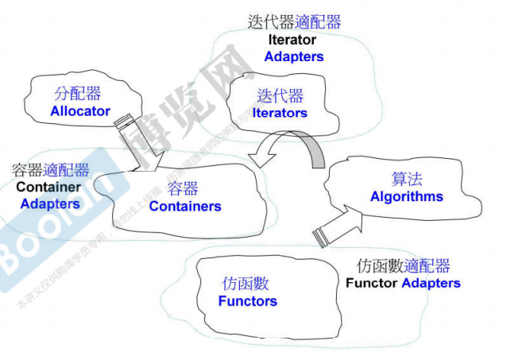

## C++容器：

- 顺序容器 `vector` 、`deque`(双端队列)、` list`(双向)、`forward_list`、 `array`、 `string`

- 关联容器

  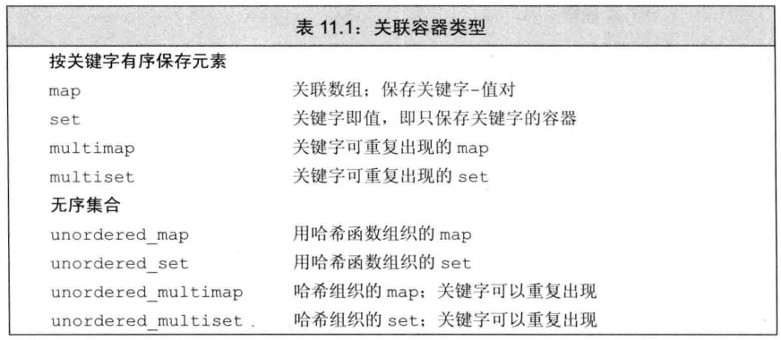

- 几乎所有的容器都维护两个迭代器`start`、`finish`，用于两个成员函数`front()`、`back()`.

### C++vector底层实现？

#### 结构图

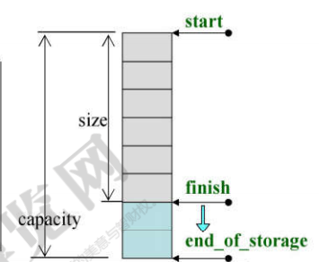

#### 元素

```c++
template<class T, class Alloc=alloc>
class vector
{
public:
    typedef T value_type;
    typedef value_type* iterator;  //array 和vector的迭代器都是指针 其他容器的迭代器是类
protected:
    iterator start;
    iterator end;
    iterator end_of_storage;
}
```

#### 迭代器

array 和vector的迭代器都是指针 其他容器的迭代器是类

#### 具体实现

vector是一种序列是容器，其数据安排以及操作方式与array类似，两者的唯一差别就是对于空间运用的灵活性，众所周知，array占用的是静态空间，一旦配置了就不可以改变大小，如果遇到空间不足的情况还要自行创建更大的空间，并手动将数据拷贝到新的空间中，再把原来的空间释放。vector则使用灵活的动态空间配置。

#### `push_back`

```c++
void push_back(const T& x)
{
    if(finish != end_of_storage) //如果有可用空间
        先将finish-1的元素值赋值给finish，然后++finish;
    else  //如果没有可用空间
        如果vector的old_size=0，则new_size=1
        如果old_size！=0，则new_size=2*old_size(vc下是1.5倍)，然后分配一段这么大内存空间，通过拷贝构造将原vector拷贝过去，然后执行析构函数将旧vector释放掉。
}
```


### C++ deque底层实现？

stack和queue底层都是deque，不允许遍历，不提供迭代器，不是容器

为什么不提供迭代器呢？stack queue公认的只能在某一段拿元素，如果提供了iter就破坏了这个规则

#### 结构图

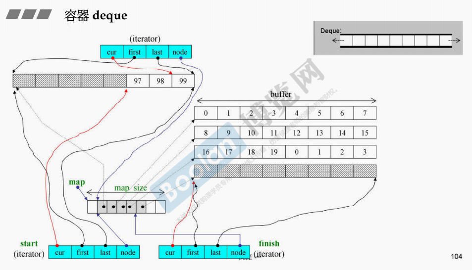

#### 元素

```c++
template<class T, class Alloc=alloc,size_t BufSiz=0>
class deque
{
protected:
    iterator start;
    iterator finish;
    map_pointer map;
    size_type map_size;
}
```

#### 迭代器 

`random_access_iterator` 支持跳转

```c++
struct __deque_iterator
{
    T* cur;             
    T* first;
    T* last;
    map_pointer node;
}
```

#### 具体实现

deque是由一个一个的buffer组合而成的，所以他的连续是分段连续的。当一个buffer满了以后会分配另一个buffer。而具体如何分配是通过`map`和迭代器一起实现的，他的类型是T**，里面存放的是各个buffer的首地址，迭代器里有`T** node`，node指向当前缓冲区在map中的位置，当cur与last相等的时候，node就会指向下一个buffer。

而buffer具体的大小是有模板参数的第三个参数决定的。n默认是0，如果我们指定n的大小，那么一个缓冲区就放n个元素，如果没有指定，假设元素大小为sz，如果sz>=512，则每个buffer放一个元素，如果小于512，则每个buffer放512/sz个元素

#### `insert`

```c++
iterator insert(interator position, const value_type& x)
{
    if(position.cur==start.cur)      //如果插入位置在头端调用push_front
        push_front(x)
    else if(position.cur==last.cur)	 //在尾端调用push_back
        push_back(x)
    else   
    {
        //如果插入位置在前半段就将插入位置之前的元素往前推 
        //如果在后半段就将插入位置之后的元素往后退
    }
}
```

### C++RB-tree具体实现

#### 结构图

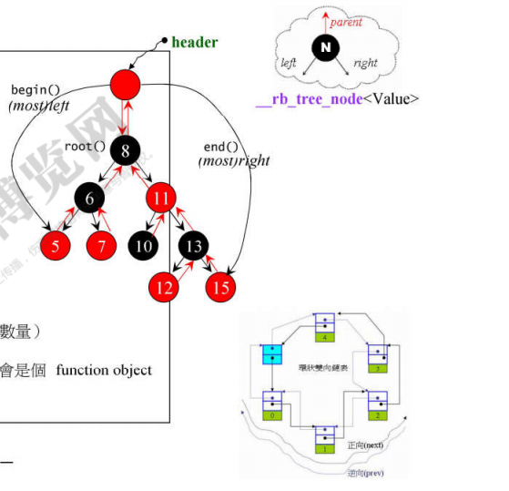

#### 元素

```c++
template <class Key,
		  class Value,
	      class KeyOfValue,  //从key中取value的方式
          class Compare,	 //比较大小的方式（仿函数）
	      class Alloc=alloc>
class rb_tree
{
protected:
    size_type node_count;
    link_type header;
    Compare key_compare;   //key的大小比较准则
}
```

### C++ set/multiset实现

无法使用set/multiset的iterators改变元素的值，其底层是RB-tree的const_iterator

```c++
template <class Key,
          class Compare = less<Key>,
          class Alloc = alloc>
class set
{
public:
    typedef Key key_type;   //key就是value, value就是key
    typedef Key value_type;
    typedef Compare key_compare;
    typedef Compare value_compare;
private:
    typedef _Rb_tree<key_type, value_type, 
    _Identity<value_type>, key_compare, Alloc> rep_type;
    rep_type t; //底层是rb_tree
public:
    //typename 告诉编译器rep_type::const_iterator是个类型而不是成员
    typedef typename rep_type::const_iterator iterator;
};
//具体使用的时候
set<int> iset;
set<int,less<int>,alloc> iset;
rb_tree<int,int,identity<int>,less<int>,alloc> //key和value一致
```


### C++map/multimap实现

无法使用map/multimap的iterators改变元素的key，但能改变data

```c++
template <class Key,
          class T,
          class Compare = less<Key>,
          class Alloc = alloc>
class map
{
public:
    typedef Key key_type;
    typedef T data_type;
    typedef T mapped_type;
    typedef pair<const Key, T> value_type; //value 是指key|data 总体，key不能改变所以加了const
    typedef Compare key_compare;
private:
    typedef _Rb_tree<key_type, value_type,
                     _Select1st<value_type>, key_compare, Alloc> rep_type;
    rep_type t;
public:
    typedef typename rep_type::iterator iterator;
};

//具体使用
map<int,string> imap;
map<int,string,less<int>,alloc> imap;
rb_tree<int,pair<const int,string>,_Select1st<pair<const int,string>>,less<int>,alloc> rbtree;
```

#### map独特的operator[]

输入mp[key] 如果这个key存在，通过lower_bound()返回这个key指向的迭代器，如果key不存在，就会返回最适合放key的迭代器，然后插入元素。

### C++ hashtable具体实现

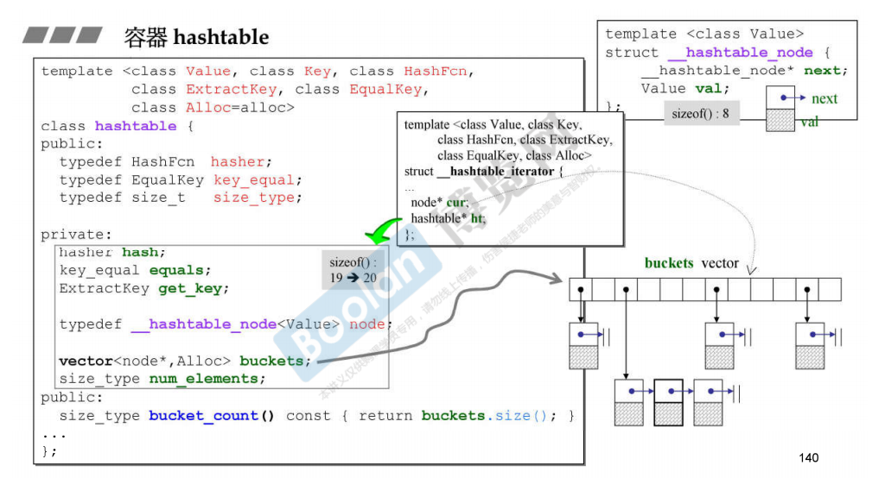

六个模板参数：分别是value，key，HashFcn，ExtractKey(如何获取key）,EqualKey(key什么时候相等)，alloc。

使用开链法解决hash冲突。每个哈希表里头有一个bucket，类型是`vector<node*>`，在设计bucket的数量上，其内置了28个质数[53，97，193....429496729]，在创建hashtable，会根据存入的元素个数选择大于等于元素个数的质数作为hashtable的容量（vector的长度），如果插入元素的个数超过了bucket的大小，就会选择与两倍旧size距离最近的质数作为新的bucket容量，然后重新计算元素位置。

迭代器只能++,不能--。

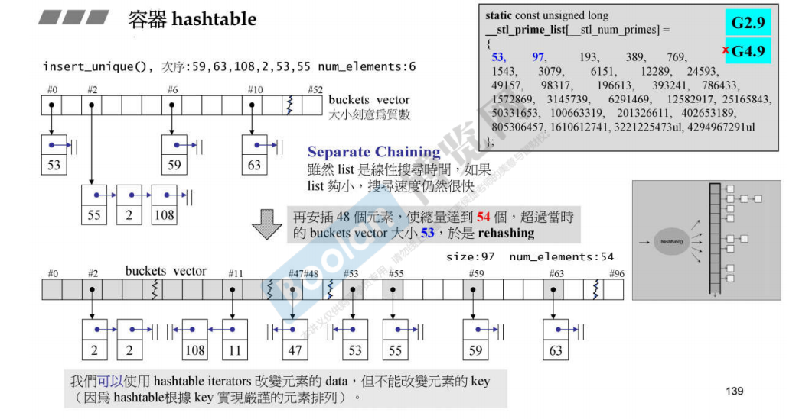


## C++迭代器

输入迭代器、输出迭代器、前向迭代器、双向迭代器、随机存取迭代器

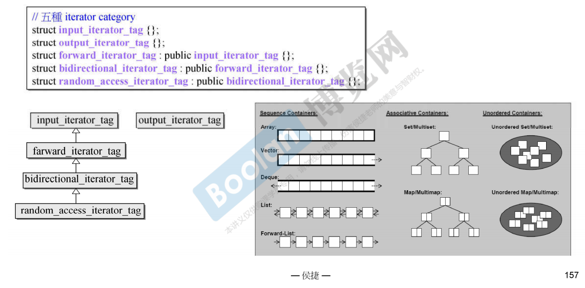

### iterator_category对算法的影响

源代码通过模板参数会暗示你应该传入那种类型的迭代器。

- sort()只能传入随机存取迭代器
- rotate()只能是单向迭代器
- reverse_copy()只能是双向迭代器
- distance()find()只能是输入迭代器

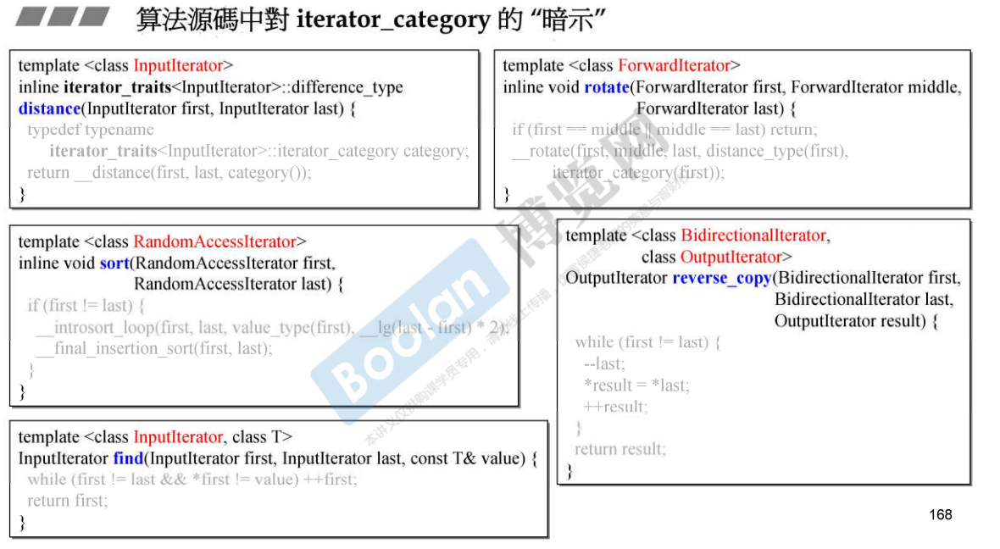

以**``distance()``**为例，他内部调用`__distance`，而`__distance`会根据第三个参数迭代器类别调用不同的重载版本。同时也体现了将**迭代器设计成继承关系的好处**，假如说传进去一个`farward_iterator_tag`迭代器，没有与之对应的重载版本，但是`farward_iterator_tag`继承至`input_iterator_tag`，会调用后者的重载版本，因此避免对每个类型都写一个重载版本。

```c++
template<typename _InputIterator>
inline typename iterator_traits<_InputIterator>::difference_type
distance(_InputIterator __first, _InputIterator __last)
{
     // __distance要根据第三个参数选择对应的重载版本
     return __distance(__first, __last,__iterator_category(__first));
}
//重载版本1 随机存取迭代器
template<typename _RandomAccessIterator>
inline typename iterator_traits<_RandomAccessIterator>::difference_type
__distance(_RandomAccessIterator __first, _RandomAccessIterator __last,
           random_access_iterator_tag)
{
      return __last - __first;
}
//重载版本2 输入迭代器
template<typename _InputIterator>
inline typename iterator_traits<_InputIterator>::difference_type
__distance(_InputIterator __first, _InputIterator __last,
            input_iterator_tag)
{
    typename iterator_traits<_InputIterator>::difference_type __n = 0;
    while (__first != __last)
	{
	  ++__first;
	  ++__n;
	}
    return __n;
}
```


### 简单说一下C++中的traits机制

英文名称是特征特性，人为设计的一种萃取机，丢给他一种东西希望萃取出你想要的特征。常用的有**iterator_traits和type_traits.**

#### iterator_traits

迭代器的五种特性(associated_type)：（前三个使用居多）

- value_type：迭代器所指对象的类型
- difference_type：两个迭代器之间的距离
- iterator_category：迭代器类型
- pointer：迭代器所指向的类型
- reference：迭代器所引用的类型

STL中的算法通常传入迭代器，算法会向迭代器提问，想知道迭代器的某种特性进而采取对应的解决办法。【那么为什么非得要用traits呢？】

如果迭代器是个类，那么他内部可以通过typedef告诉算法他的五种特性，但假如说迭代器只是一个指针(被称为退化的迭代器)就不能用typedef了，必须用traits。

```c++
//这是一个算法
template<typename I>
inline void algorithm(I first, I last)
{
    I::itertator_category;//算法向迭代器提问， 想知道他的迭代器类型
    I::value_type;//算法向迭代器提问， 想知道他所指对象的类型
}
//这是迭代器，他是一个类
template<class T> 
struct _iterator
{
    typedef T value_type;
    typedef bidirectional_iterator_tag iterator_category;
}
```

具体用法：**Iterator Traits**用以分离**class iterators**和**non-class iterator**

```c++
template<class I> //迭代器是class
struct iterator_traits{
	typedef typename I::value_type value_type;  
};
template<class T>//迭代器不是class而是指针
struct iterator_traits<T*>{
    typedef T value_type;
};
//于是算法要知道I的value_type时
template<typename I>
void algorithm()
{
    typename iterator_traits<I>::value_type v1;
}
```

#### [type_traits](https://blog.csdn.net/lihao21/article/details/55043881)

负责萃取型别的特性，这些特性是指这个型别是否具备non-trivial-defalt ctor，是否具备non-trivial copy ctor，是否具备non-trivial assignment operator，是否具备non-trivial dtor，如果没有我们在对这个型别进行构造析构拷贝赋值等操作时，就可以采用最有效率的措施，例如采用内存直接处理操作`malloc()`，而根本不调用ctor，dtor。

C++11之前定义了__type_traits类，使用方法`__type_traits<Foo>::has_trivial_destructor`，他的结果应该是一个有着真/假性质的**对象**，而不是一个bool值，因为我们希望利用其响应结果进行参数 推导，而编译器只有面对`class object`形式的参数才会做参数推到。他为所有C++标量型别都定义了对应的特化版本，告诉使用者类型的基本特性。而对于我们自己定义的类型则需要我们自己写一个特化版本因此很不方便。

以**`copy()`**为例

```c++
template<class InputIterator,class OutputIterator>
OutputIterator copy(InputIterator first,InputIterator last, OuctputIterator result){};
```

如果模板参数是两个指针类型的迭代器`<T*,T*>`，通过`type_traits`判断这个类型的拷贝赋值是否重要，如果是`has trivial op=()`重要直接调用`memmove()`，如果是`has non_trivial op=()`则需要调用拷贝赋值。

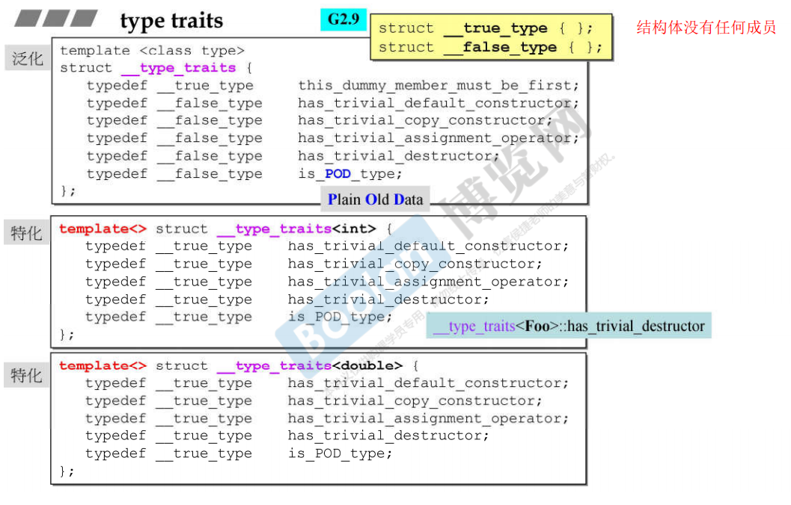

C++11后，增加了二三十种type_traits，例如`is_void is integral ,has_virtual_destructor,is_copy_constructible`等等。

使用方法`is_void<T>::value`

## C++仿函数

C++的仿函数是一些模板类，例如`greater,less`(比大小），他们内部会对`()`操作符进行重载，都会继承`unary_function`和`binary_function`这两个父类其中之一，这样才能融入STL中。这两个类没有data大小为0，实际大小通常为1，如果他是父类有人继承他，则一定为0；

```c++
template<class Arg,class Result>
struct unary_function// 这一类仿函数需要一个参数
{
	typedef Arg argument_type;
    typedef Result result_type;
};
template<class Arg1,class Arg2,class Result>
struct binary_function//需要两个参数
{
    typedef Arg1 first_argument_type;
    typedef Arg2 second_argument_type;
    typedef Result result_type;
}
```

```c++
template<class T>
struct greater:public binary_function<T,T,bool>
{
  	bool operator()(const T& x,const T& y)const
    {return x>y;}  
};
```

## C++适配器(Adaptor)

### 容器适配器 

stack和queue底层容器都是deque，他们的具体操作都是通过调用底层deque成员函数实现的

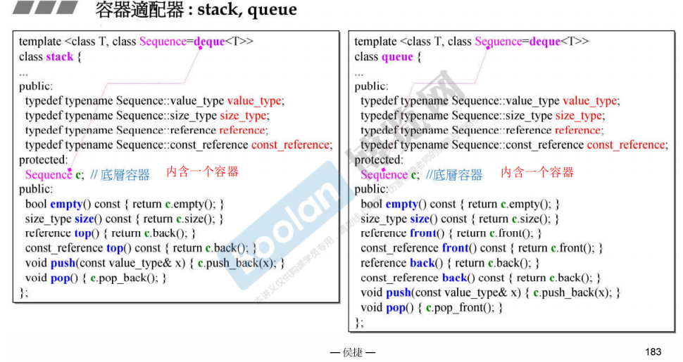

### 函数适配器

## C++分配器

分配器`allocator`是个模板类 有两个成员函数`allocate`和`deallocate`，内部分别调用`operator new` 和`operator delete`

```c++
template<class T>
class allocator
{
public:
    pointer allocate(指针类型，指针个数){};//内部调用operator new
    void deallocate(指针，指针个数){};//内部调用operator delete
}
```

