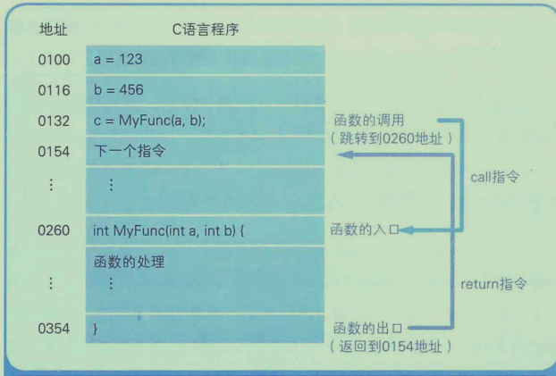
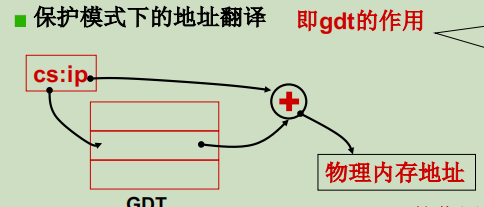
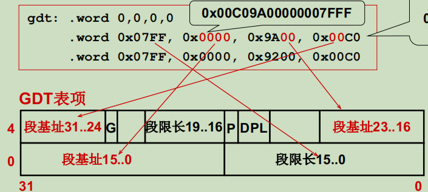
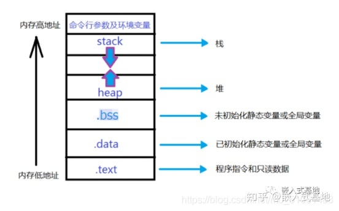
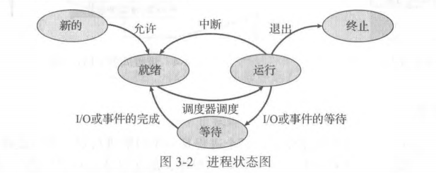
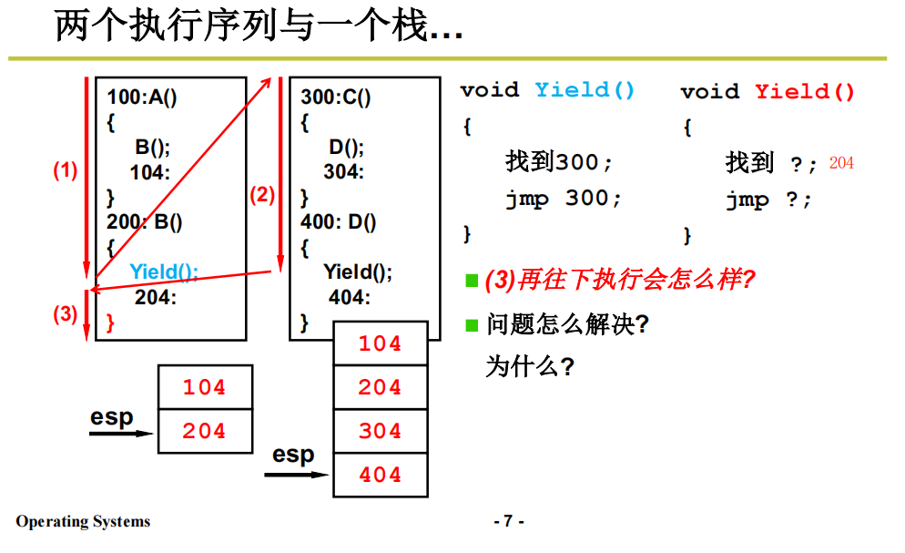
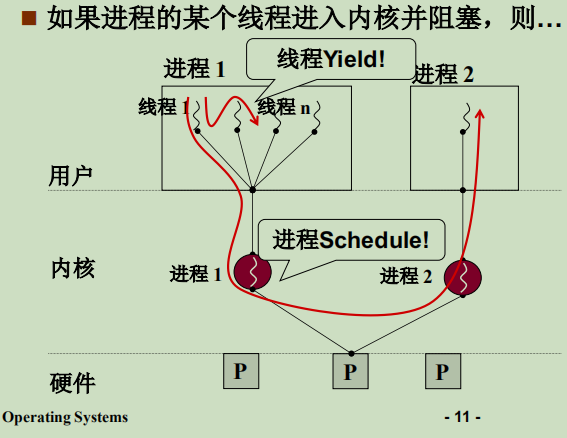
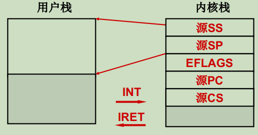
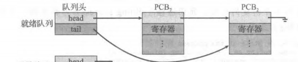

# 操作系统

## 1. CPU中的寄存器

|    种类    | 功能                                                         |
| :--------: | :----------------------------------------------------------- |
| 累加寄存器 | 存储执行运算的数据和运算后的数据                             |
| 标志寄存器 | 存储运算处理后的CPU状态                                      |
| 程序计数器 | 存储下一条指令所在的内存地址                                 |
| 基址寄存器 | 存储数据内存的起始地址                                       |
| 变址寄存器 | 存储基址寄存器的相对地址                                     |
| 通用寄存器 | 存储任意数据                                                 |
| 指令寄存器 | 存储指令。CPU内部使用，程序员无法通过程序对该寄存器进行读写操作 |
|  栈寄存器  | 存储栈区域的起始地址                                         |

## 2.  条件语句和循环语句执行机制

累加寄存器计算条件语句，将结果存入标志寄存器中，CPU根据标志寄存器中的值决定是否执行跳转。

## 3. 函数调用

call指令会把调用函数后要执行的指令地址存储在栈中，函数处理完毕之后在通过函数的出口执行return指令。return将保存在栈中的地址设定到程序计数器中。

程序执行到函数调用处，通过call指令将程序计数器设置到函数入口处，同时将函数调用处的下一个地址存入栈中。当函数执行完毕之后，通过return指令将栈中保存的地址设置给程序计数器，然后开始执行函数的下一个指令。



## 4. 内存实际地址=基址寄存器+变址寄存器

## 5. 打开计算机执行的第一句指令是什么

- x86 PC刚开机时CPU处于实模式 （实模式寻址方式：物理地址=段地址<<4+段内偏移）

- 开机时，段寄存器CS=0xFFFF; 段内偏移IP=0x0000

- 寻址0xFFFF0(ROM BIOS映射区，这段程序固化到ROM上)

- BIOS映射区的代码执行：检查RAM，键盘，显示器，软硬磁盘

- 将磁盘0磁道0扇区(引导扇区)的代码（512字节）读入0x7c00处

- 设置CS=0x07c0,IP=0x0000

  

开机后BIOS必须从boot扇区（引导扇区,0磁道0扇区）读入代码bootsect.s，然后bootsect必须从第二个扇区读入setup，setup必须从第五个扇区读入system。boot setup都是16位汇编

system中的第一段代码为head.s，其中有一段代码将0 0 0 L6压入栈中 然后跳转到设置页表，完了执行ret，后会执行main()函数，main的三个参数是0 0 0，main函数返回时会进入L6死循环，所以main永不返回。

| 0    |
| ---- |
| 0    |
| 0    |
| L6   |
| main |

```c
void main(void)
{
    mem_init();
	trap_init();
	blk_dev_init();
	chr_dev_init();
	tty_init();
	time_init();
	sched_init();
	buffer_init();
	hd_init();
	floppy_init();
	sti();
	move_to_user_mode();//这两段代码使main永不返回
	if(!fork()){init();}//	
}
```


## 6、操作系统启动的大致流程

boot：将操作系统从磁盘上读进来

setup：设置了一些参数（如90002表示内存大小），启动了保护模式

head：初始化GDT表，跳到main

main：好多参数第一个是mem_init()，初始化mem_map，设置空闲内存。

## 7、计算机的寻址方式：

#### 实模式：

CPU地址线20根 可以表示地址总数为2^20=1024*1024字节=1M。寻址方式：段寄存器地址左移四位+偏移（cs:ip)

#### 保护模式：

CPU地址线32根  可以表示地址总数为2^32=1024*1024*1024*4字节=4G。寻址方式：cs是GDT表中的索引（0，8，16.....），从表中取出基址在于ip偏移相加。（通过Intel硬件实现）



在CPU内部通过cr0寄存器进行两种模式切换：将cr0寄存器PE置为0为实模式，置为1为保护模式

#### GDT表项

每一个表中有64位，8个字节，0低4位。下图最后取出的地址00000000



## 8、C程序在内存中的表示

- .test代码段
- .data数据段
- .bss未初始化
- heap堆
- stack栈



## 9、操作系统的接口：系统调用

## 10、如何实现内核程序和用户程序的隔离

CPU分为内核态，用户态，内存分为内核段和用户段。用DPL表示这段内存中的特权级，CPL表示当前正在执行的代码所在的段的特权级。每个程序都有PC，PC又是由CS:IP组成，用CS中的最低两位表示CPL，0是内核态，1、2 OS服务，3是用户态。用户态的特权级是3，而要访问的内核态的这段内存的特权级是0，因此通过jmp，mov都不能访问。

## 11、如何主动进入内核

硬件提供了主动进入内核的方法，对于Intel x86来说就是中断指令 int 0x80。int指令使CS中的CPL改成0，可以进入内核。

- 用户程序中包含一段int指令（通过库函数实现）的代码
- 操作系统写中断处理，获取想调程序的编号
- 操作系统根据编号执行相应代码

## 12、CPU如何工作

首先程序载入内存中，设置PC，CPU发出取址指令，内存将PC所指的指令放入地址总线上，然后CPU解释执行这个地址上的命令，然后PC自动累加。总的来说就是取址执行。

## 13、进程状态图



- 新的(new)：进程正在创建
- 就绪(ready)：进程等待分配CPU
- 运行(running)：指令正在执行
- 阻塞(waiting)：进程等待发生某个事件（如IO完成或收到信号）
- 终止(terminated)：进程执行完成

## 14、多进程如何交替

主要分为三个部分： 队列操作+调度+切换

```c
//一个进程需要磁盘读写，那么此时就要进行进程切换
pCur.state='W';  				//将该进程设置成阻塞态
将pCur放到DiskWaitQueue;		  //该进程放到磁盘等待队列
schedule()						//开始切换
{
    pNew=getNext(ReadyQueue);	 //调度新的进程
    switch_to(pCur,pNew);		 //与当前进程进行切换
}
//切换需要完成的工作
switch_to(pCur,pNew)
{
    将当前CPU中进程的PCB拷贝一份给PCB1,将新进程的PCB赋值给CPU，当需要切换回原来进程的时候;
    就将原来进程的PCB1重新赋值给CPU
}
```

## 15、多进程如何处理内存地址冲突

每个进程有自己的映射表。通过虚拟内存映射表。

## 16、线程的引出

进程=资源+指令执行序列，切换进程的时候是否可以只改变PC而映射不变，引出了线程

## 17、用户级线程

**两个线程共用一套栈的问题**：

从100开始执行，遇到函数B将104压栈跳到B执行，遇到yield()将204压栈，切到右边的线程，跳到300去执行，遇到D(),将304压栈然后跳到400执行，遇到yiedl()将404压栈，切回左边线程，跳到204，然后回遇到B函数的右括号(相当于一条汇编指令ret)，这个时候应该弹出204跳到104，但是发现栈顶是404，出错了。



每个线程有自己的用户栈、TCB（线程控制块），通过Yield()进行线程切换。

切换：每个线程有自己的栈，自己的TCB，切换的时候首先通过切换TCB切换到相应的栈，然后通过PC弹出执行序列。

缺点：



## 18、核心级线程

进程：资源和执行序列组成，而执行序列起始就是内核级线程。

SS：堆栈段地址，SP：堆栈的偏移地址



**核心级线程的切换**：内核栈和用户栈构成一套栈，用户线程通过中断进入内核线程，内核线程通过switch to(CPU调度)切换到另一个内核线程，然后新的内核线程通过iret中断返回到新的用户线程。

**内核线程switch_to五段论：**

```c
//1、中断入口：（进入切换）
//2、中断处理：（引发切换）
	启动磁盘读或时钟中断；
	schedule();引出切换，找出下一个内核的TCB
3、schedule()
{
	call switch_to;内核切换
}
4、switch_to()://内核栈切换
{	
	TCP[cur].esp=%esp;
    %esp=TCP[next].exp;
}
5、中断出口：（第二级切换）
iret;
```

## 19、内核级线程的具体实现

```c
main()						用户栈 1.main:
{								 		ret=exit
    A();						  2.A:ret=B
    B();					内核栈   ss:sp   //ss指向1  sp指向2
}								   EFLAGS
A()								   ret=3
    							   system_call
{
    fork();//fork()展开成一段包含INT的代码	
}

/*-------------------------中断入口-------------------------*/
//fork()展开成一段包含INT的代码	
mov %eax,__NR_fork //将__NR_fork系统调用号置给eax
INT 0x80
3.mov res,%eax //eax 就是fork()的返回值，如果是父进程eax非0，子进程为0
    
//INT 0x80的中断处理函数
void sched_init(void)
{
    set_system_gate(0x80,&system_call);
}
//system_call
_system_call:
push %ds..%fs
pushl %edx...
call sys_fork //通过调用system call table进入内核具体处理sys_fork
pushl %eax
/*-------------------------sys_fork-------------------------*/ 
_sys_fork:
push %gs; pushl %esi
...
pushl %eax
call _copy_process //复制进程
addl $20,%esp
ret

//copy_process
int copy_process(int nr,long ebp,long edi,long esi,long gs,long none,long ebx,long ecx,long edx, long fs,long es,long ds,long eip,long cs,long eflags,long esp,long ss){};
//copy_process细节：创建栈
p=(struct task_struct *)get_free_page();//获取mem_map中为0的那部分空闲内存，因为是内核态代码，所以										不能用malloc(这个是用户态获取内存)
//1.申请内存空间 （esp0内核栈，esp用户栈）
p->tss.esp0 = PAGE_SIZE + (long) p;	    //PAGE_SIZE=4
p->tss.ss0 = 0x10;					  //0x10内核数据段 ss0内核堆栈段
//2.创建内核栈 
p->tss.ss = ss & 0xffff;			  //ss,esp来自父进程
p->tss.esp = esp;
//3.创建用户栈(和父进程共用栈)
   
//接下来执行
movl _current,%eax  	//将当前线程置给eax
cmpl $0,state(%eax)		//_current只PCB，将eax加state,意思就是判断当前PCB中的state是否为0
    				   //0是运行或者就绪，非0是阻塞
jne reschedule		    //如果不是0说明当前为阻塞，就得切换
cmpl $0,counter(%eax)	//counter：时间片，如果时间片用光了
je reschedule		    //也得切换
ret_from_sys_call:		//中断返回

/*-------------------------中断出口-------------------------*/
ret_from_sys_call:（一堆pop）
popl %eax //返回值 popl %ebx 
pop %fs ...
iret//
    
/*-------------------------切换switch_to-------------------------*/
/*
TSS任务结构段（包含了CPU所有的寄存器，包含了这个任务所有的信息）  基于TSS切换 变到  内核的切换 TSS切换只需要一句长跳转指令 但耗时长 
1、将当前CPU寄存器放在当前TR中，根据TR（操作系统固有的寄存器）这个选择子在GDT表中找到 原TSS描述符，根据描述符找到原TSS段,这样就把当前CPU的线程拷贝给了原TSS段。
2、然后一个长跳转指令 ljmp %0\n\t 将TR指向新的任务段TSS(n)，然后找到新的TSS描述符，找到新的TSS段，将TSS段中新的线程在扣给CPU
*/
```

## 19、CPU调度策略

First Come First Served(FCFS)

SJF：短作业优先

## 20、Linux 0.11的调度函数schedule( )

```c
/*目标找到一个next，while循环实现了优先调度，for循环实现了优先级动态调整*/
void Schedule(void) //在kernel/sched.c中
{ 
    while(1) 
	{ 
      	c=-1; next=0; i=NR_TASKS;
	    p=&task[NR_TASKS];								   //p设成最后一个地址
		while(--i)
        { 
            if((*p->state == TASK_RUNNING && (*p)->counter>c) //TASK_RUNNING就绪态 c=-1
				c=(*p)->counter, next=i; 
        }
		if(c) break; 						 		//找到了最大的counter跳出去执行switch_to
               										//这个时候counter代表优先级 counter大的先被调度
		for(p=&LAST_TASK;p>&FIRST_TASK;--p)			  //如果就绪态进程的时间片都用完了都用完了 
               										//或者非就绪态
         {
             (*p)->counter=((*p)->counter>>1)+(*p)->priority; 
             /*
             如果是就绪态进程，此时counter为0，然后设置成priority（counter初值）
             如果是阻塞态， 就把counter设置成counter/2+初值，肯定比此时的counter大
             */
         }
      }       	
      switch_to(next);	
}
```

## 21、counter作用

```c
//在时钟中断的时候：时间片
void sched_init(void)
{
    set_intr_gate(0x20,&timer_interrupt);
}
_timer_interrupt:
	...
    call _do_timer
void do_timer(...)
{
   if(--current->counter>0) //每次counter--
       return;
   current->counter=0;      //counter为0调用
   schedule();
}
```

## 22、生产者消费者代码

```c
#define BUFFER_SIZE 10
typedef struct{...} item;
item buffer[BUFFER_SIZE];
int in=out=counter=0;
//生产者进程
while(true)
{
	while(counter==BUFFSIZE)
}
```


## 线程和进程的比较

- 线程启动速度快，轻量级
- 线程的系统开销小
- 线程使用有一定的难度，需要处理数据一致性问题
- 同一线程共享的有堆、全局变量、静态变量、指针、引用、文件等，而有各自的栈

## 线程和进程的区别

- 调度：线程是调度的基本单位(PC，通用寄存器，线程栈，栈指针等)；
- 并发性：一个进程内多个线程可以并发(最好和CPU核数相等)
- 拥有资源：线程不拥有系统资源，但一个进程的多个线程可以公用一套资源，进程是拥有资源的基本单位；
- 系统开销：线程创建销毁只需要处理PC，通用寄存器，线程栈以及栈指针即可，进程还需要重新分配以及销毁task_struct(进程控制块)结构

## 同一个进程可以创建多少个线程，和什么有关？

一个进程可用虚拟空间时2G，默认情况下线程大小1M，因此可以创建2048个线程，如果多余2048的话需要更改编译器的设置。因此，一个进程可以创建的线程数由可用虚拟空间和线程的栈的大小共同决定。

## 外中断和异常有什么区别？

外中断是CPU执行指令以外的事件引起，如时钟中断、键盘中断、它机中断和外部设备中断。

异常是由CPU执行指令的内部事件引起，如非法操作、地址越界、溢出等。

## 进程调度算法？

作业队列：

就绪队列：驻留在内存中的、就绪的、等待运行的进程保存在就绪队列。其头节点有两个指针，用于指向链表的第一个和最后一个PCB块；每个PCB还包括一个指针.指向就绪队列的下一个PCB。



- **先来先服务 FCFS**（first-come first-serverd）

  非抢占式的调度算法，按照请求的顺序进行调度。先请求CPU的进程会首先分配到CPU。可以通过FIFO队列实现。当一个进程进入就绪队列时，它的PCB会被链接到队列尾部。当CPU空闲时，它会分配给位于队列头部的进程，并且这个运行进程从队列中移去。

  有利于长作业，但不利于短作业，因为短作业必须一直等待前面的长作业执行完毕才能执行，而长作业又需要执行很长时间，造成了短作业等待时间过长。

- **短作业优先 SJF（shortest job first）**（最短下次CPU执行）

  当CPU变为空闲时，它会被赋给具有最短CPU执行的进程。如果两个进程具有同样长度的CPU执行，那么可以由FCFS来处理。长作业有可能会饿死，处于一直等待短作业执行完毕的状态。因为如果一直有短作业到来，那么长作业永远得不到调度。

  用于批处理系统长期调度。

  **如何知道下次CPU执行的长度？**

  一种方法是试图近似SJF调度。虽然不知道下一个CPU执行的长度，但可以预测它。可以认为下一个CPU执行的长度与以前的相似。因此，通过计算下一个CPU执行长度的近似值，可以选择具有预测最短CPU执行的进程来运行。

- **最短剩余时间优先SRTN（shortest remaining time next）**

  最短作业优先的抢占式版本，按剩余运行时间的顺序进行调度。 当一个新的作业到达时，其整个运行时间与当前进程的剩余时间作比较。如果新的进程需要的时间更少，则挂起当前进程，运行新的进程。否则新的进程等待。

- **时间片轮转**

  将所有就绪进程按 FCFS 的原则排成一个队列，每次调度时，把 CPU 时间分配给队首进程，该进程可以执行一个时间片。

  当时间片用完时，由计时器发出时钟中断，调度程序便停止该进程的执行，并将它送往就绪队列的末尾，同时继续把 CPU 时间分配给队首的进程。

  时间片轮转算法的效率和时间片的大小有很大关系：

  - 因为进程切换都要保存进程的信息并且载入新进程的信息，如果时间片太小，会导致进程切换得太频繁，在进程切换上就会花过多时间。
  - 而如果时间片过长，那么实时性就不能得到保证。

- **优先级调度**

  每个进程都有一个优先级与其关联，而具有最高优先级的进程会分配到CPU，具有相同优先级的进程按FCFS顺序调度。

  缺点：优先级调度算法的一个主要问题是**无穷阻塞**（indefinite blocking）或**饥饿**（starvation）。 为了防止低优先级的进程永远等不到调度，可以随着时间的推移提高等待进程的优先级。

- **多级队列调度**

  将就绪队列分成多个单独队列，根据进程的属性将一个进程永久的加入到一个队列。每个队列 有自己的调度算法。例如，可有两个队列分别用于前台进程和后台进程。前台队列可以采用RR算法调度，而后台队列可以采用FCFS算法调度。

  队列之间应有调度，通常采用固定优先级抢占调度。例如.前台队列可以比后台队列具有绝对的优先。每个队列与更低层队列相比具有绝对的优先。只有当优先级高的队列为空，才会执行低优先级队列内的进程。

  另一种可能是，在队列之间划分时间片。高优先级划分的CPU时间更多。

  优点：调度开销低

  缺点：进程只能在自己的队列，不够灵活，所以有多级反馈队列

- **多级反馈队列**

  

## 长期调度、中期调度、短期调度

[长期调度、中期调度、短期调度](https://blog.csdn.net/dan15188387481/article/details/49426375)

## Linux下进程间的通信方式？

- **管道：**

  - **普通管道**：管道是一种半双工的通信方式，数据只能单向流动。通信的双方必须是父子进程。

    通过`int pipe(int fd[2])`创建管道，`fd[0]`读出端`fd[1]`写入端。

    管道并非属于进程的资源，而是和套接字一样，属于操作系统（也就不是 fork 函数的复制对象）。所以，两个进程通过操作系统提供的内存空间进行通信。

    fork()复制的不是管道而是文件描述符。

  - **命名管道：**（FIFO文件，借助文件系统）：有名管道也是半双工的通信方式，但是允许在没有亲缘关系的进程之间使用，管道是先进先出的通信方式。

- **共享内存**：共享内存就是映射一段能被其他进程所访问的内存，这段共享内存由一个进程创建，但多个进程都可以访问。共享内存是最快的IPC方式。

- **消息队列**：消息队列是有消息的链表，存放在内核中并由消息队列标识符标识。消息队列克服了信号传递信息少、管道只能承载无格式字节流以及缓冲区大小受限等缺点
- **套接字**：适用于不同机器间进程通信，在本地也可作为两个进程通信的方式。

- **信号量**：信号量是一个计数器，可以用来控制多个进程对共享资源的访问。它常作为一种锁机制，实

  现进程、线程的对临界区的同步及互斥访问。

## Linux下同步机制？

- POSIX信号量：用于进程同步、线程同步
- POSIX互斥锁+条件变量：只能用于线程同步

## 进程同步的四种方法

- **临界区**

  通过对多线程的串行化来访问公共资源或一段代码，保证在某一时刻只有一个线程能访问数据

  临界区不是内核对象，只能用于进程内部的线程同步，而不可用来同步多个进程中的线程，是用户方式的的同步

- **互斥量(mutex)**

  多个进程在同一时刻只有一个能进入临界区，0表示临界区加锁，1表示解锁。mutex为1的时候进程访问临界区，会进行加锁操作，互斥量--成为0，当再有进程访问他的时候该进程会阻塞；当该进程离开临界区的时候，会进行解锁操作，互斥量++成为1，别的进程可以访问他了。

- **信号量(semaphore)**

  信号量就是大小为N的互斥量，当N为1的时候就是互斥量了，可以对其进行`sem_wait()`

  &`sem_post()`操作

  

## 进程状态的切换你知道多少？


- 新的(new)：进程正在创建
- 就绪(ready)：进程等待分配CPU
- 运行(running)：指令正在执行
- 阻塞(waiting)：进程等待发生某个事件（如IO完成或收到信号）
- 终止(terminated)：进程执行完成

只有就绪态和运行态可以相互转换，其余都是单向的。就绪状态的进程通过调度算法从而获得CPU时间，转为运行态。而运行状态的进程，通过中断(在分配给他的CPU时间片用完之后就会)转为就绪态，等到下一次调度。

阻塞状态是缺少需要的资源从而由运行态转换而来，如IO/和时间的等待，不是确实CPU时间。