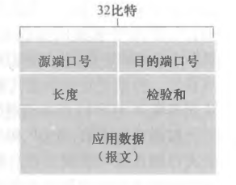
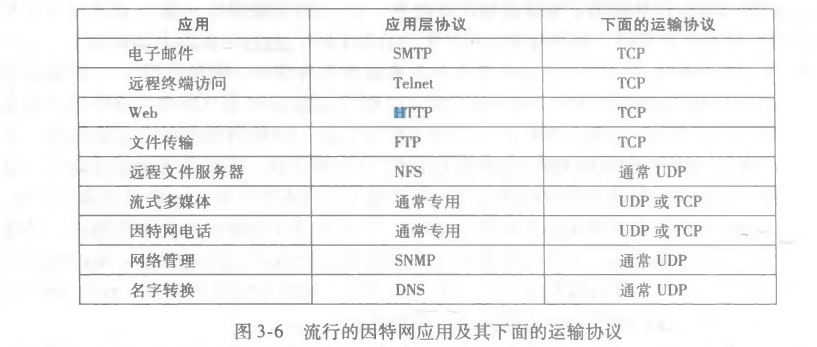
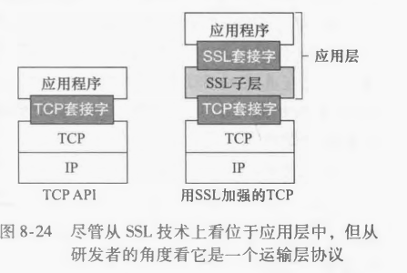
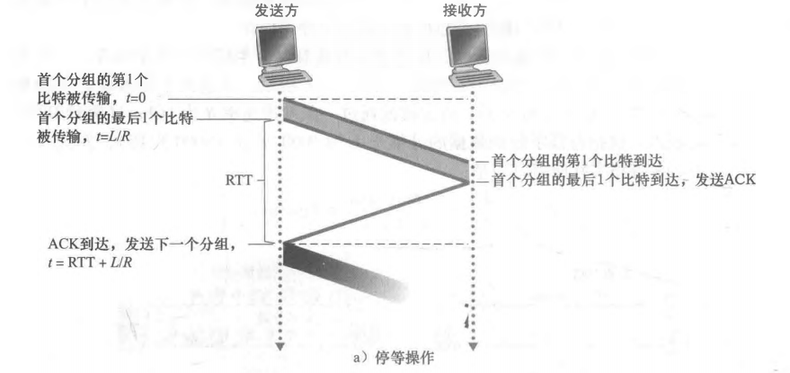
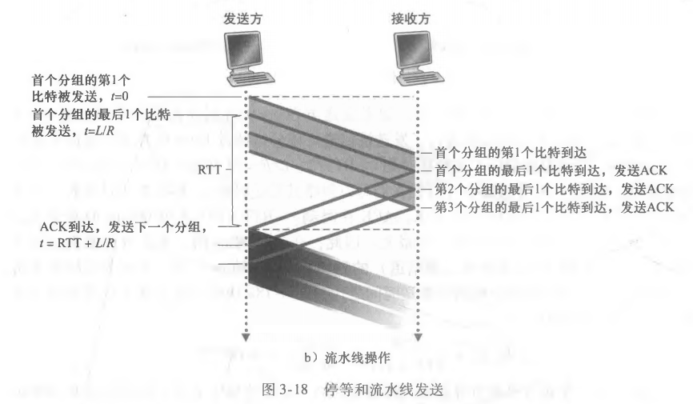

## OSI 的七层模型分别是？各自的功能是什么？

​		计算机通信诞生初期，系统化标准化未得到足够的重视。ISO（国际标准化组织）制定了一个国际标准OSI（开放式通信系统互联参考模型）。TCP/IP是由**IETF**建议的。网络七层模型是一个标准而非实现，网络四层模型是一个实现的应用模型。网络四层模型是由七层模型简化合并来的。

- 应用层：针对特定应用的协议。包括文件传输、电子邮件、远程登陆等协议
- 表示层：将设备固有的数据格式转化为网络标准数据格式（不同设备对同一比特流解释的结果可能不同）
- 会话层：负责建立和断开通信连接。何时建立连接，何时断开连接，以及保持多久的连接。
- 传输层：管理两个节点（互联的网络终端）之间的数据传输。负责可靠传输（非损坏、无间隔、非冗余、按序）。
- 网络层：将数据传输到目标地址。主要负责寻址和路由选择。
- 数据链路层：负责物理层面上互连的节点之间的通信传输。将01序列划分为具有意义的数据帧穿送给对端。
- 物理层：负责01（序列）与电压的高低、光的闪灭之间的转换。底层的数据传输

## 说一下一次完整的HTTP请求包括那些内容？

客户机（浏览器）域名解析——通过三次握手与服务器建立TCP连接——发起HTTP请求报文——服务器发送HTTP响应报文，浏览器得到HTML代码——浏览器解析HTML代码，并请求HTML代码中的资源——浏览器将页面呈现给用户

多数Web页面中有一个HTML基本文件和以及几个引用对象，在基本文件中通过URL地址对对象进行引用。URL包括两部分：服务器主机名和对象路径名。

## DNS是什么呢？

DNS（Domain Name System）域名系统，因特网上作为域名和IP地址相互映射的一个分布式数据库，能够使用户更方便的访问互联网，而不用去记住能够被机器直接读取的IP数串。

通过主机名，最终得到该主机名对应的IP地址的过程叫做域名解析

运行在UDP上，使用53号端口。

## DNS服务器组成

- 根DNS服务器  
- 顶级域TLD服务器（com edu net gov ）
- 权威DNS服务器

## DNS工作原理

​	**有缓存**

1. 浏览器先检查自己的缓存是否有域名映射的IP地址，如果有解析结束
2. 若没有，检查操作系统缓存有没有解析过的结果，如果有解析结束
3. 若没有，请求本地DNS服务器

```
yhb.gdut.edu 想知道 td.xidian.edu的IP地址
前者的本地DNS服务器地址dns.gdut.edu
后者的权威DNS服务器地址dns.xidian.edu
```

​	**无缓冲**

1. yhb.gdut.edu主机先向本地DNS服务器发送一个DNS查询报文（含有被转换的主机名）
2. 本地DNS服务器将该报文转发到根DNS服务器
3. 根DNS服务器根据顶级域名前缀（比如说是edu）返回负责这个edu的TLD的IP地址
4. 本地DNS服务器再次向TLD发送查询报文
5. 该TLD服务器注意到xidian.edu前缀，用权威DNS服务器的IP地址进行响应
6. 最后本地服务器直接向权威DNS服务器重发查询报文，然后这个权威DNS服务器用要查询的域名的IP地址进行响应。

## DNS为什么是应用层协议

- 使用客户机/服务器模式在通信的端系统之间允许
- 在通信的端系统之间通过下面的端到端的运输层协议来传送DNS报文

## DNS查询方式有哪些？

**递归解析**

当本地DNS服务器自己不能回答客户机的DNS查询时，它就需要向其他DNS服务器进行查询。此时有两种方式。**局部的DNS服务器自己负责向其他DNS服务器进行查询，一般是先向该域名的根服务器查询，再由该跟服务器一级一级向下查询**，最后得到的结果返回给本地DNS服务器，然后返回给客户端。

**迭代解析**

当本地DNS服务器自己不能回答客户机的DNS查询时，也可以通过迭代查询的方式进行解析。**本地DNS服务器不是自己向其他DNS服务器进行查询，而是把能解析该域名的服务器IP地址返回给客户端DNS程序，客户端DNS程序再继续向这些DNS服务器进行查询，直到得到查询结果为止。**迭代解析只是帮你找到相关的服务器而已，而不会帮你去查。

## HTTP持久连接和非持久连接	

- 持久连接（长连接）：应用程序所有的请求响应经过相同的TCP连接发送，默认使用持久连接
- 非持久连接（短连接）：每个请求响应经过单独的TCP连接发送

在非持久连接下，加入一个web页面包含一个HTML基本文件和10个JPEG图形，那么客户机需要与服务器建立11个TCP连接；而在持久连接下，服务器发送响应后保持TCP连接打开，相同的客户机与服务器之间后续的请求和响应可以经过相同的TCP连接进行发送，如果一个连接经过一定时间没有被使用，服务器就会断开连接。

## HTTP请求报文

```c++
GET /somedir/page html HTTP/1.1 //请求行：方法字段 URL字段 HTTP版本字段
Host: www someschool.edu        //对象所在主机，该首部行提供的信息是Web代理高速缓存所要求的即使已经有									一条TCP链接存在
Connection: close				//浏览器告诉服务器使用短链接
User-agent: Mozilla/5.0			//指用户代理，即向服务器发送请求的浏览器的类型
Accept-language: fr				//用户想得到的语言版本
```


## HTTP请求方法

HTTP1.0 定义了三种请求方法： GET, POST 和 HEAD方法。

HTTP1.1 新增了六种请求方法：OPTIONS、PUT、PATCH、DELETE、TRACE 和 CONNECT 方法。

- GET：当浏览器请求一个对象时，使用GET方法，服务器返回返回响应报文请求对象
- HEAD：类似于 GET 请求，返回响应报文并不返回请求对象，用于获取报头（通常用于程序调试）
- POST：向指定资源提交数据进行处理请求（例如提交表单或者上传文件）。数据被包含在实体体中
- PUT：PUT方法常与Web发行工具联合使用，它允许用户上传对象到指定的Web服务器上指定的路径（目录）。
- DELETE：DELETE方法允许用户或者应用程序删除Web服务器上的对象。

## GET和POST区别

- 

## HTTP响应报文

```c++
//状态行
HTTP/1.1 200 OK					//状态码
//六个首部行
Connection: close				//发送完报文后 将关闭该TCP连接
Date: Tue, 18 Aug 2015 15:44:04 GMT//首部行指示服务器产生并发送该响应报文的日期和时间
Server: Apache/2.2.3 (CentOS)	   //服务器的类型
Last-Modified: Tuer 18 Aug 2015 15:11:03 GMT//指示了对象创建或者最后修改的日期和时间
Content-Length: 6821			  //被发送对象中的 字节数
Content-Type: text/html           //首部行指示了 实体体中的对象是HTML文本
//实体体
(data data data data data •••)
```

常见状态码：

- 200 OK ：请求成功
- 301 Moved Permanently：请求的对象已经被永久转移了，客户软件将自动获取新的URL
- 400 Bad Request: 一个通用差错代码，指示该请求不能被服务器理解
- 404 Not Found:被请求的文档不在服务器上
- 505 HTTP Version Not Supported:服务器不支持请求报文使用的HTTP协议版本。

## cookie

HTTP 协议是**无状态**的，主要是为了让 HTTP 协议尽可能简单，使得它能够处理大量事务，HTTP/1.1 引 入 Cookie 来保存状态信息。

Cookie 是**服务器发送到用户浏览器并保存在本地的一小块数据**，它会在浏览器之后向同一服务器再次发起请求时被携带上，用于告知服务端两个请求是否来自同一浏览器。

cookie 的出现是因为 HTTP 是无状态的一种协议，换句话说，服务器记不住你，可能你每刷新一次网页，就要重新输入一次账号密码进行登录。这显然是让人无法接受的，cookie 的作用就好比服务器给你贴个标签，然后你每次向服务器再发请求时，服务器就能够 cookie 认出你。

**cookie技术有4个组件**

- 在HTTP响应报文中的一个cookie首部行
- HTTP请求报文中的一个cookie首部行；
- 在用户端系统中保留有一个cookie文件，并由用户的浏览器进行管理；
- 位于Web站点的一个后端数据库。

**cookie工作原理**

当用户第一次访问Web站点，请求报文到达Web服务器，将产生一个唯一的标识码，并以此作为索引在它的后端数据库中产生一个表项。接下来Web服务器用一个包含Set-cookie：首部的HTTP响应报文对用户浏览器进行响应，浏览器收到了该HTTP响应报文时，它会看到该Set-cookie：首部。该浏览器在它管理的特定cookie文件中添加一行，该行包含服务器的主机名和Set-cookie:首部中的识别码。之后用户每次访问Web页面，其浏览器就会查询该cookie文件并抽取她对这个网站的识别码，并放到HTTP请求报文中包括识别码的cookie首部行。

**cookie用途：**

- 会话状态管理（如用户登录状态、购物车、游戏分数或其它需要记录的信息）
- 个性化设置（如用户自定义设置、主题等）
- 浏览器行为跟踪（如跟踪分析用户行为等）

## Session

除了可以将用户信息通过 Cookie 存储在用户浏览器中，也可以利用 Session 存储在服务器端，存储在服务器端的信息更加安全。

Session 可以存储在服务器上的文件、数据库或者内存中。也可以将 Session 存储在 Redis 这种内存型数据库中，效率会更高。

**使用 Session 维护用户登录状态的过程如下：**

1. 用户进行登录时，用户提交包含用户名和密码的表单，放入 HTTP 请求报文中；
2. 服务器验证该用户名和密码，如果正确则把用户信息存储到 Redis 中，它在 Redis 中的 Key 称为Session ID；
3. 服务器返回的响应报文的 Set-Cookie 首部字段包含了这个 Session ID，客户端收到响应报文之后将该Cookie 值存入浏览器中；
4. 客户端之后对同一个服务器进行请求时会包含该 Cookie 值，服务器收到之后提取出 Session ID，从Redis 中取出用户信息，继续之前的业务操作。

**Session工作原理**

session 的工作原理是客户端登录完成之后，服务器会创建对应的 session，session 创建完之后，会把session 的 id 发送给客户端，客户端再存储到浏览器中。这样客户端每次访问服务器时，都会带着sessionid，服务器拿到 sessionid 之后，在内存找到与之对应的 session 这样就可以正常工作了。

**Session安全性问题**

Session ID 的安全性问题，不能让它被恶意攻击者轻易获取，那么就不能产生一个容易被猜到的 Session ID 值。此外，还需要经常重新生成 Session ID。在对安全性要求极高的场景下，例如转账等操作，除了使用 Session 管理用户状态之外，还需要对用户进行重新验证，比如重新输入密码，或者使用短信验证码等方式。

## Session与cookie对比

- **cokkie**

Cookie是客户端保持状态的方法。

Cookie简单的理解就是存储由服务器发至客户端并由客户端保存的一段字符串。为了保持会话，服务器可以在响应客户端请求时将Cookie字符串放在Set-Cookie下.客户机收到Cookie之后保存这段字符串，之后再请求时候带上Cookie就可以被识别。

Cookie在客户端的保存形式可以有两种：

- 会话cookie：将服务器返回的Cookie字符串保持在内存中，关闭浏览器之后自动销毁

- 持久cookie：持久Cookie则是存储在客户端磁盘上，其有效时间在服务器响应头中被指定，在有效期内，客户端再次请求服务器时都可以直接从本地取出，存储在磁盘中的Cookie是可以被多个浏览器代理所共享。

- Session是服务器保持状态的方法

首先需要明确的是，Session保存在服务器上，可以保存在数据库、文件或内存中，每个用户有独立的Session用户在客户端上记录用户的操作。我们可以理解为每个用户有一个独一无二的Session ID作为Session文件的Hash键，通过这个值可以锁定具体的Session结构的数据，这个Session结构中存储了用户操作行为。

## Session与cookie适用场景

- Cookie 只能存储 ASCII 码字符串，而 Session 则可以存储任何类型的数据，因此在考虑数据复杂性时首选 Session；
- Cookie 存储在浏览器中，容易被恶意查看。如果非要将一些隐私数据存在 Cookie 中，可以将 Cookie 值进行加密，然后在服务器进行解密；
- 对于大型网站，如果用户所有的信息都存储在 Session 中，那么开销是非常大的，因此不建议将所有的用户信息都存储到 Session 中。

## Session和Cookie区别

- 存储位置不同：  cookie：存放在客户端，session：存放在服务端。Session存储的数据比较安全

- 存储数据类型不同 ：

  两者都是key-value的结构，但针对value的类型是有差异的

  cookie：value只能是字符串类型，session：value是对象类型

- 存储大小限制：cookie：大小受浏览器的限制，很多是是4K的大小， session：理论上受当前内存的限制

- 生命周期的控制：若生命周期以20分钟为例：

  cookie的生命周期是**累计**的，从创建时，就开始计时，20分钟后，cookie生命周期结束

  session的生命周期是**间隔**的，从创建时，开始计时如在20分钟，没有访问session，那么session生命周期被销毁

## MTU和MMS分别是什么？

MTU：maximum transmission unit，最大传输单元，一个链路层帧能承载的最大数据单元。

MMS：Maximum Segment Size，TCP可从缓存中去除并放入报文段中的数据数量，受限于TCP报文段中数据段的大小，**通常根据最初确定的由本地发送主机发送的最大链路层帧长度来设置**。

## 什么是TCP粘包/拆包？发生原因？

一个完整的业务可能会被TCP拆分成多个包进行发送，也有可能把多个小的包封装成一个大的数据包发送，这个就是TCP的拆包和粘包问题。

**原因**

- 应用程序写入数据的字节大小大于套接字发送缓冲区的大小
- 文件较大，TCP将其分割成大小位MSS的若干块
- 以太网的payload大于MTU进行IP分片

**解决方案**

- 消息定长
- 在包尾部增加回车或者空格符等特殊字符进行分割
- 将消息分为消息头和消息尾
- 使用其它复杂的协议，如RTMP协议等

## TCP是什么？

TCP（Transmission Control Protocol 传输控制协议）是一种面向连接的、可靠的、基于字节流的传输层通信协议。

## TCP报文段结构


TCP报文段由**首部字段**和**数据字段**组成。

- **16bit源端口号和目的端口号**：源端口号就是指本地端口，目的端口就是远程端口。

- **32bit序号字段**：用于 TCP 通信过程中某一传输方向上字节流的每个字节的编号，为了确保数据通信的有序性，避免网络中乱序的问题。

- **32bit确认号字段**：确认序列号是接收确认端所期望收到的下一序列号。确认序号应当是上次已成功收到数据字节序号加1，只有当标志位中的 ACK 标志为 1 时该确认序列号的字段才有效。主要用来解决不丢包的问题。

- **16bit接收窗口字段**：指示接收方愿意接受的字节数量

- **4bit首部长度字段**：该字段指示了以32比特的字为单位的TCP首部长度。通常为空，TCP首部典型长度为20byte。

- **6bit的标志字段**：它们中的多个可同时被设置为 1，主要是用于操控 TCP 的状态机的，依次为URG，ACK，PSH，RST，SYN，FIN。

  - **ACK**：发送端发送数据到接收端，发送的时候 ACK 为 0，标识接收端还未应答，一旦接收端接收数据之后，就将 ACK 置为 1，发送端接收到之后，就知道了接收端已经接收了数据。

  - **SYN**：表示**同步序列号**，是TCP握手发送的第一个数据包。用来建立TCP连接 。通常与ACK搭配使用。当连接请求的时候，SYN=1，ACK=0，当连接被响应的时候，SYN=1，ACK=1。

    这个标志的数据包经常被用来进行端口扫描。扫描者发送一个只有 SYN 的数据包，如果对方主机响应了一个数据包回来 ，就表明这台主机存在这个端口。

  - **FIN**：表示发送端数据已经到达数据末尾，也就是说双方的数据传送完成了，发送FIN标志位的TCP数据包后，连接将被断开。

## UDP是什么

UDP(User Datagram Protocol)用户数据报协议，提供**无连接**的，尽最大努力的数据传输服务（**不保证数据传输的可靠性**）。

## UDP报文结构



## TCP/UDP对应应用层协议



## TCP/UDP的区别？

- TCP面向连接（如打电话要先拨号建立连接）;UDP是无连接的，即发送数据之前不需要建立连接

- TCP提供可靠的服务，也就是说通过TCP连接传送的数据，无差错，不丢失，不重复，按序到达；而UDP尽最大努力交付，不保证可靠交付

- TCP面向字节流，实际上TCP把数据看成一连串无结构的字节流；而UDP是面向报文的

- UDP没有拥塞控制，因此网络出现堵塞不会使源主机的发送速率降低(对实时应用很有用，如实时视频会议)

- 每一条TCP连接只能是端到端的，而UDP支持一对一 一对多 多对一 多对多的交互通信

- TCP首部20字节，UDP首部只有8字节

- TCP的逻辑通信信道是全双工的可靠信道，UDP则是不可靠信道

- UDP是面向报文的，需要**应用层控制报文大小**。发送方的UDP对应用层交下来的报文，不合并，不拆分，只是在其上面加上首部后就交给了下面的网络层，无论应用层交给UDP多长的报文，它统统发送，一次发送一个。而对接收方，接到后直接去除首部，交给上面的应用层就完成任务了。因此，它需要应用层控制报文的大小

  TCP是面向字节流的，它把上面应用层交下来的数据看成无结构的字节流会发送，可以想象成流水形式的，发送方TCP会将数据放入“蓄水池”（缓存区），等到可以发送的时候就发送，不能发送就等着TCP会根据当前网络的拥塞状态来确定每个报文段的大小。

## 常见的TCP连接状态？

- `CLOSED`：初始状态
- `LISTEN`：服务器处于监听状态
- `SYN_SEND`：客户端`socket`执行`CONNECT`连接，发送`SYN`包，进入此状态。
- `SYN_RECV`：服务端收到`SYN`包并发送服务端`SYN`包，进入此状态。
- `ESTABLISH`：表示连接建立。客户端发送了最后一个`ACK`包进入此状态，服务端接收到`ACK`包后进入此状态。

## TCP三次握手

三次握手其实就是指建立一个TCP连接时，需要客户端服务器总共发送三个包。进行三次握手的主要作用就是为了确认双方的接受能力和发送能力是否正常。指定自己的初始化序列号后还要为后面的可靠性传送做准备。实质上就是连接服务器的指定端口，建立TCP连接，并同步连接双方的序列号和确认号，交换TCP窗口信息。

- 第一次握手：客户端给服务端发送一个特殊报文段，该报文不包含应用层数据，其中首部同步位SYN位志位1（SYN报文段），另外客户端随机的选择一个初始序号seq=client_isn。该报文段会封装到一个IP数据报，并发送给服务器。此时，客户端处于SYN_SEND状态。
- 第二次握手：服务器收到SYN报文段后，为该TCP连接分配**TCP缓存和变量**，并向客户TCP发送允许连接的报文段。该报文段首部SYN被置为1，确认号字段ACK被置为client_isn+1，表明自己收到了客户端的SYN，最后服务器选择自己的初始化序号server_isn。该允许连接的报文段为SYNACK报文段。此时客户端处于SYN_RCVD状态。
- 第三次握手：客户端收到 SYN 报文之后，会发送一个 ACK 报文，当然，也是一样把服务器的 ISN + 1 作为 ACK 的值，表示已经收到了服务端的 SYN 报文，此时客户端处于ESTABLISHED状态。服务器收到ACK报文段后，也处于ESTABLISHED状态。双方建立起连接，SYN位置为0。

## 为什么要三次握手，两次不行吗？

- 第一次握手：客户端发送网络包，服务端收到了，这样服务端就能得出结论：**客户端的发送能力、服务端的接受能力是正常的。**
- 第二次握手：服务端发送网络包，客户端收到了，这样客户端就能得出结论：**服务端的接受、发送能力是正常的。客户端的接收、发送能力是正常的**。不过此时**服务器并不能确认客户端的接收能力是否正常**。
- 第三次握手：客户端发送网络包，服务端收到了，这样服务端就能得出结论：客户端的接受、发送能力正常。服务器自己的发送、接收能力也正常。

因此，需要三次握手才能确认双方的接收与发送能力是否正常。

## 如果两次握手会出现什么情况呢？

如果客户端发出连接请求，但连接请求报文出现丢失未被确认，于是客户端再发送一次连接请求，然后收到了服务端的确认，建立了连接。数据传输完成后释放了连接。客户端共发出了两个连接请求报文段，其中第一个丢失，第二个到达了服务端，但是第一个丢失的报文段只是在**某些网络结点长时间滞留了，延误到连接释放以后的某个时间才到达服务端**，此时服务端误认为客户端又发送了个连接请求，于是向客户端发出确认报文段，同意建立连接，但客户端忽略发来的确认不发送数据，服务端一直等待客户端发送数据，浪费了资源。

## 三次握手可以携带数据吗？

第三次可以，第一次第二次不可以。

为什么这样呢?大家可以想一个问题，假如第一次握手可以携带数据的话，如果有人要恶意攻击服务器，那他每次都在第一次握手中的 SYN 报文中放入大量的数据。因为攻击者根本就不理服务器的接收、发送能力是否正常，然后疯狂着重复发 SYN 报文的话，这会让服务器花费很多时间、内存空间来接收这些报文。

第一次握手不可以放数据，原因之一就是**让服务器更加容易受攻击**。而第三次，客户端处于ESTABLISHED状态，对于客户端来说已经建立连接，也知道服务端的接收发送能力正常，也就可以携带数据了。

## 什么是半连接队列？

服务器第一次收到客户端的`SYN`后就会处于`SYN_RCVD`状态，此时双方还没有完全建立连接，服务器会把此种状态的连接请求放在一个队列里，这种队列为**半连接队列**。

三次握手之后建立起的连接放在**全连接队列**。如果队列满了就有可能会出现丢包现象。

**SYN_ACK重传次数**：服务器发送完SYN-ACK包，如果未收到客户确认包，服务器进行首次重传，等待一段时间仍未收到客户确认包，进行第二次重传。如果重传次数超过系统规定的最大重传次数，**系统将该连接信息从半连接队列中删除**。 注意，每次重传等待的时间不一定相同，一般会是指数增长，例如间隔时间为 1s，2s，4s，8s......

## ISN(Initial Sequence Number)是固定的吗？

三次握手的其中一个重要功能是客户端和服务端交换 ISN(Initial Sequence Number)，以便让对方知道接下来接收数据的时候如何按序列号组装数据。如果ISN是固定的，攻击者很容易猜出后续的确认号，因此 ISN 是动态生成的。

## SYN攻击是什么？

服务器的资源分配是在**二次握手时分配**的，而客户端是在完成**三次握手的时候分配**的，所以服务器容易受到SYN洪泛攻击。SYN攻击就是Client在短时间内伪造大量不存在的IP地址，并向Server不断地发送SYN包，Server则回复确认包，并等待Client确认，由于源地址不存在，因此Server需要不断重发直至超时，这些伪造的SYN包将长时间占用**未连接队列**，导致正常的S**YN请求因为队列满而被丢弃**，从而引起网络拥塞甚至系统瘫痪。

SYN 攻击是一种典型的 DoS/DDoS 攻击。

**预防攻击**

检测 SYN 攻击非常的方便，当你在服务器上看到大量的半连接状态时，特别是源IP地址是随机的，基本上可以断定这是一次SYN攻击。在 Linux/Unix 上可以使用系统自带的 netstats 命令来检测 SYN 攻击。

`netstat -n -p TCP | grep SYN_RECV`

- 缩短超时时间
- 增加最大半连接数
- 过滤网关保护
- `SYNcookies`技术

## TCP四次挥手

因为TCP是全双工的，所以关闭请求服务端客户端都可以发送。刚开始双方都处于`ESTABLISHED`状态

假设客户端先断开连接。

- 第一次挥手：假如客户端的数据已经发送完毕，发送**连接释放报文段**（FIN=1，seq=u）告诉服务端，客户端数据已经全发完了，服务端可以关闭接收了，但是如果服务端有数据发给客户端客户端还可以接受。此时客户端处于**`FIN_WAIT1`**（终止等待1）状态，等待服务端的确认。
- 第二次挥手：服务端接收到客户端的FIN报文后，知道客户端没有数据发给自己了，然后发送**确认报文**（ACK=1 确认号ack=u+1 序号seq=y）给客户端，告诉客户端收到你的连接释放报文,服务端进入**`CLOSE_WAIT`**（关闭等待状态）。客户端收到服务端的确认报文段后进入**`FIN_WAIT2`**(终止等待2)，**等待服务端的连接释放报文段**.
- 第三次挥手：此时服务端的数据发送完了，然后发送**连接释放报文段**(FIN=1,ACK=1，seq=w，确认号ack=u+1第一次挥手的序号+1)，此时服务端处于**`LAST_ACK`**(最后确认)状态，等待客户端确认。
- 客户端收到 FIN 之后，一样发送一个 **确认报文**（ACK=1，确认号ack=w+1,seq=u+1）作为应答，此时客户端处于 **`TIME_WAIT`**(时间等待) 状态，此时TCP未释放掉，需要经过时间等待计时器设置的时间**2MSL**后，客户端才进入CLOSED状态。服务端收到 ACK 报文之后，就处于关闭连接了，处于**`CLOSED`**状态。

收到一个FIN只意味着在这一方向上没有数据流动。**客户端执行主动关闭进入TIME_WAIT状态，服务端通常执行被动关闭不会进入TIME_WAIT状态**。

在socket编程中，任何一方执行close()操作即可产生挥手操作。

## 2MSL等待状态

每个TCP实现必须选择一个报文段最大生成时间MSL（Maximum Segment Lifetime)，它是任何报文段被丢弃前在网络内的最长时间。这个时间是有限的，因为TCP报文段以IP数据报在网络内传输，而IP数据报则有限制其生存时间的TTL字段。

对一个具体实现所给定的MSL值，处理的原则是：当TCP执行一个主动关闭，并发回最后一个ACK，该连接必须在TIME_WAIT状态停留的时间为2倍的MSL。这样可让TCP再次发送最后的ACK以防这个ACK丢失（另一端超时并重发最后的FIN）。

## 四次挥手释放连接时，等待2MSL的意义

为了保证客户端最后一个ACK到达服务器。因为这个确认报文可能丢失，从而导致处在LAST_ACK状态的服务器收不到对FIN-ACK的确认报文。服务器会重新发送FIN_ACK，接着客户端再重传一次确认，重新启动**时间等待计时器**。最后服务器和客户端都能正藏关闭。假设客户端再发送完最后一个ACK后不等待2MSL而直接释放关闭，一旦这个ACK丢失的话，服务器就无法正常的进入关闭状态。

## 为什么TIME_WAIT状态需要等待2MSL才能回到CLOSE状态？

客户端发送的最后一个ACK丢失，服务器等待1MSL没收到，然后重新发送FIN-ACK，等待1MSL后到达客户端。客户端收到后重启2MSL计时器，发送ACK。因此客户端只需等待2MSL，如果没有再次收到说明服务端已经收到自己的ACK了，双方都可以关闭连接。

## 什么是SSL？

SSL（Secure Sockets Layer）安全套接字层。SSL 版本3的一个稍加强修改的版本被称为运输层安全性（Transport Layer Security, TLS）

TCP还是UDP都没有提供任何加密机制，发送进程以明文方式（即没有加密）发送了一个口令进入它的套接字，该明文口令将经过发送方与接收方之间的所有链路传送，这就可能在任何中间链路被嗅探和发现。SSL提供了关键的进程到进程的安全性服务。

SSL不是与TCP和UDP在相同层次上的第三种因特网运输协议，而是一种对TCP的加强，这种强化是在应用层上实现的。



## 停等协议利用率低的原因？

发送发送完一个分组之后，只有收到接收方的ACK才会发送下一个分组。假设从t=0发送分组第一个比特，t=8微秒最后一个比特进入发送端信道，发送端到接收端RTT=30ms，则经历15ms，第一个分组到达接收端，在经历15ms，ACK到达发送端，这个时候发送端才继续发送第二个分组，中间的30ms啥也没干很浪费。

所以用**流水线协议**，一次同时发送多个分组。

- 停等协议保证可靠数据传输用到的技术：检验和、序号、定时器、肯定和否定确认
- 流水线协议：回退N部和选择重传。





## 滑动窗口

已被发送但还未被确认的分组的许可序号范围可以被 看成是一个在序号范围内长度为N的窗口

## TCP拥塞产生原因

数据发送方投放到网络中的数据超出了网络的承载能力，网络中存在瓶颈(就像水管的流量取决于最细的部分)，该瓶颈的吞吐量小于节点单位时间发送的数据量。超量的数据无法从瓶颈路径发送，只好在缓冲区排队，而缓冲的大小有限制，积压的数据超出缓存区大小就会发生丢弃。

接受窗口：用户告诉发送方该接收方还有多少缓存空间。

## TCP四大拥塞控制算法？

### 慢启动算法-Slow Start

TCP连接刚建立，一点一点提速，试探一下网络的承受能力，以免直接扰乱网络通道秩序。

1. 连接建好的开始先初始化拥塞窗口cwnd为1，表明可以传一个MSS大小的数据
2. 每当收到一个ACK，cwnd大小加一，呈线性上升
3. 每当过了一个往返延迟时间RTT，cwnd直接翻倍，呈指数上升
4. 当cwnd>=ssthresh慢启动阈值，就会进入拥塞避免算法

### 拥塞避免算法-Congestion Avoidance

当拥塞窗口大小cwnd大于等于慢启动阈值ssthresh后，就进入拥塞避免算法。过了慢启动阈值后，拥塞避免算法可以避免窗口增长过快导致窗口拥塞，而是缓慢的增加调整到网络的最佳值。

1. 收到一个ACK，则cwnd=cwnd+1/cwnd
2. 每当过了一个往返延迟时间RTT，cwnd大小加一

过了慢启动阈值后，拥塞避免算法可以避免窗口增长过快导致窗口拥塞，而是缓慢的增加调整到网络的最佳值

### 拥塞发生状态时的算法

TCP拥塞控制默认认为网络丢包是由于网络拥塞导致的，所以一般的TCP拥塞控制算法以丢包为网络进入拥塞状态的信号。对于丢包有两种判定方式：一种是**超时重传RTO**，一种是**收到三个重复确认ACK(冗余ACK)**。

**超时重传**：在发送一个数据以后就开启一个计时器，在一定时间内如果没有得到发送数据报的ACK报文，那么就重新发送数据，直到发送成功为止。

**冗余ACK：**报文段1成功接收，发送到收到ACK 2，报文段2丢失，发送报文段3，接收端本来希望收到报文段2，但是现在收到的是3与期望不匹配，所以接收端重复发送ACK2。

但是如果发送端接收到**3个以上的重复ACK**，TCP就意识到数据发生丢失，需要重传。这个机制不需要等到重传定时器超时，所以叫做**快速重传**，而快速重传后没有使用慢启动算法，而是拥塞避免算法，所以这又叫做**快速恢复算法**。

**超时重传**RTO[Retransmission Timeout]超时：

- 慢启动阈值设置为当前cwnd的一半
- cwnd重置为1
- 进入慢启动过程

收到**三个重复确认ACK**：

- cwnd大小缩小为当前的一半
- 慢启动阈值设置为缩小后的cwnd大小
- 然后进入快速恢复算法Fast Recovery

### 快速恢复算法

在进入快速恢复之前，cwnd和ssthresh已经被更改为原有cwnd的一半。快速恢复算法的逻辑如下：

- cwnd=cwnd+3MSS，加3MSS原因是收到3个重复ACK
- 重传DACKs指定的数据包
- 如果再收到DACKs，那么cwnd加一
- 如果收到新的ACK，表明重传成功，退出快速恢复算法，将cwnd设置为ssthresh，然后进入拥塞避免算法。

## 解释一下RTO，RTT和超时重传分别是什么？

- **RTT (Round Trip Time)**连接往返时间：数据从发送到接收到对方响应的时间间隔，即数据报在网络中的一个往返用时。大小不稳定
- **RTO(Retransmission Time Out)**重传超时时间：从上一次发送数据，因为长期没有收到ACK响应，到下一次重发之间的时间。就是重传间隔。
  - 通常每次重传RTO是前一次重传间隔的两倍，计量单位通常是RTT。例：1RTT，2RTT，4RTT，8RTT......
  - 重传次数到达上限之后停止重传。

- **超时重传**：发送端发送报文后若长时间未收到确认的报文则需要重发该报文

## 为何重传选择三次ACK？


TCP报文段乱序情况下有2/5=40%的概率会造成A收到三次DACK(N)；如果N丢了，则A会100%概率收到三次DACK(N)。所以当A接收到三次DACK(N)启动快速重传算法是合理的。

当A接收到两次DACK(N)，则一定说明是乱序造成的，既然是乱序说明数据都到到达了B，B的TCP只要负责重排就行，A没有必要重传。

而四次DACK(N)的话更是丢包造成，但这样子的响应策略太慢，加大时延。因此选择三次。

## TCP协议如何保证可靠传输？

- 确认和重传：接收方收到报文后就会发送确认报文段给发送方，如何发送方发送一段时间后没有收到确认就会重传。
- 数据校验：TCP报文段首部有校验和字段，用于校验报文是否损坏。
- 数据合理分片和排序：TCP会按最大传输单源(MTU)合理分片，接收方会缓存未按序到达的数据，重新排序后交给应用层。而UDP：IP数据报大于1500字节，大于MTU，这个时候发送方的IP层就需要分片，把数据报分成若干片，使得每一片都小于MTU。而接收方IP层需要对数据报进行重组。由于UDP的特性，某一片数据丢失时，接收方便无法重组数据报，导致丢弃整个UDP数据报。
- 流量控制：当接收方来不及处理发送方的数据，会通过滑动窗口，提示发送方降低发送的速率，防止包丢失

## TCP的首部校验字段能保证数据传输不会出错吗？

**不能**

发送方将**伪首部**(伪首部的数据都是从IP数据报头获取的。其目的是让TCP检查数据是否已经正确到达目的地，只是单纯为了做校验用的)、**TCP首部**、**TCP数据**使用累加和校验的方式计算出一个数字，然后放在首部的检验和字段里。接收者收到TCP包后重复这个过程，然后将计算出的校验和与接收到的首部中的校验和比较，如果不一致说明传输出错。显然不能保证检查出一切错误。

这种校验和计算方式是将数据中的每16个比特位数据作为一个数字，原码相加 ，并将高位叠加到低位，取反 ，得到反码求和结果，放入校验和 。假如在传输过程中前后两个16比特位数据前后颠倒了，那么校验和计算结果是一样的。

**解决方案**

传输之前先使用MD5加密数据获得摘要，跟数据一起发送到服务端，服务端接收之后对数据也进行MD5加密，如果加密结果和摘要一致，则认为没有问题


## HTTPS是什么？

超文本传输安全协议。由HTTP通信，但通过SSL加密数据包。首先让HTTP先和SSL通信，再由SSL和TCP通信，也就是说HTTPS使用了隧道进行通信。HTTPS 具有了加密（防窃听）、认证（防伪装）和完整性保护（防篡改）。

## 网络层概述

​       发送端端系统网络层取得来自运输层的报文段，将每个报文段封装成一个数据报，然后向相邻路由器发送该数据报。接受端端系统，网路层接受来自相邻路由器的数据报，提取处运输层报文段，并将其向上交付给运输层。

​		每台路由器的**数据平面**主要作用是从其输入链路向其输出链路转发数据报，**控制平面**的主要作用是协调这些本地的每路由器转发动作，使得数据报沿着源和目的地主机之间的路由器路径最终进行端到端传送。

​		网络层主要实现两个作用：转发、路由选择。

- 转发：当一个分组到达某路由器的一条输入链路时，该路由器必须将该分组移动到适当的输出链路。
- 路由选择：当分组从发送方流向接收方时，网络层必须决定这些分组所采用的路由或路径。

## 网络层常见的协议

- IP  网际协议：是TCP/IP协议栈中最核心的协议之一，通过IP地址，保证了联网设备的唯一性，实现了网络通信的面向无连接和不可靠的传输功能。

- ICMP Internet控制报文协议：它是TCP/IP协议簇的一个子协议，用于在IP主机和路由器之间传递控制消息。控制消息是指网络通不通、主机是否可达、路由是否可用等网络本身的消息。

- RIP  路由信息协议：使用“跳数”(即metric)来衡量到达目标地址的路由距离

- IGMP Internet组管理协议：用于实现组播（多播）、广播等通信。

  - 多播：数据传输基于UDP，多播服务器针对特定多播组只发送一次数据，组内的所有客户端都会接受数据

  - 广播：也是通过UDP完成，多播可以跨越不同网络，而广播只能在同一网络。

## 数据链路层常见协议

ARP 地址解析协议：根据IP地址获取物理地址

RARP 逆地址解析协议：根据物理地址获取IP地址

PPP 点对点协议：主要是用来通过拨号或专线方式建立点对点连接发送数据，使其成为各种主机、网桥和路由器之间简单连接的一种共通的解决方案

